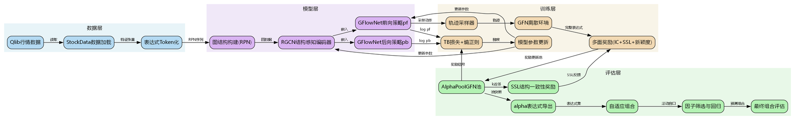
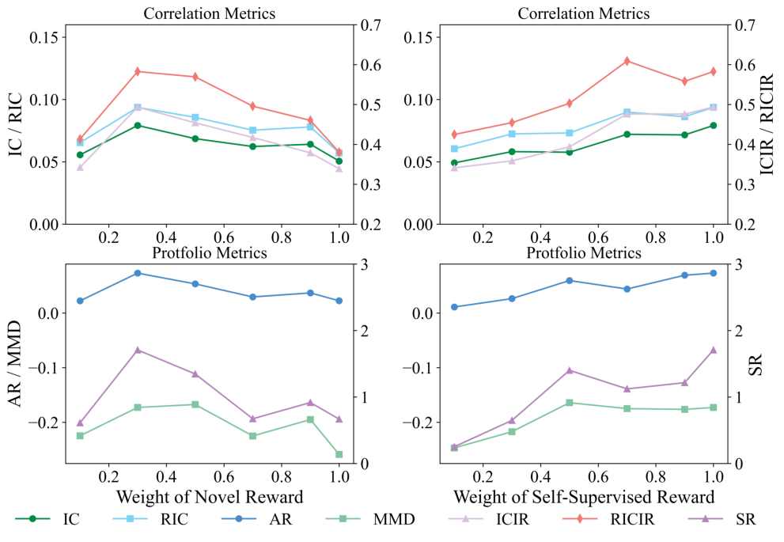
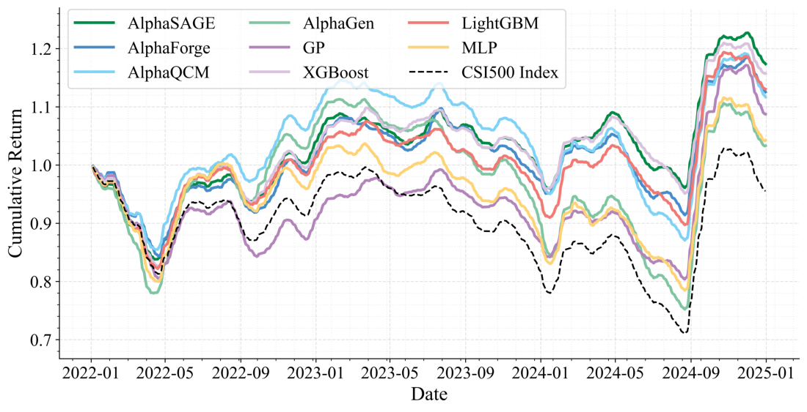
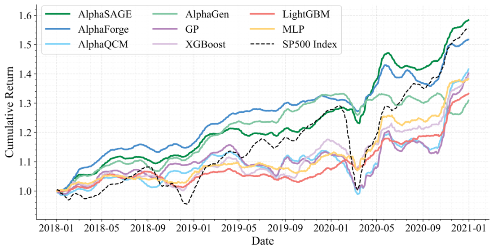
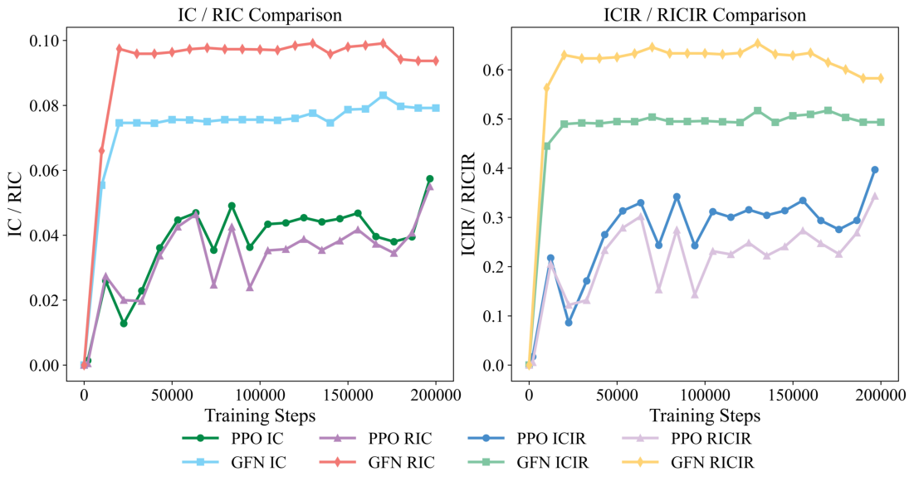
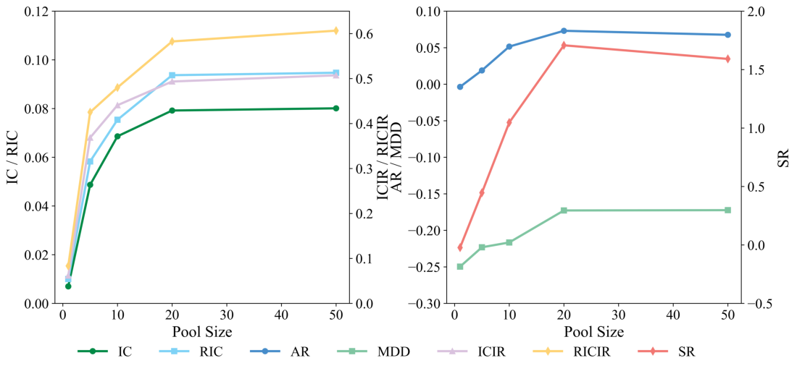
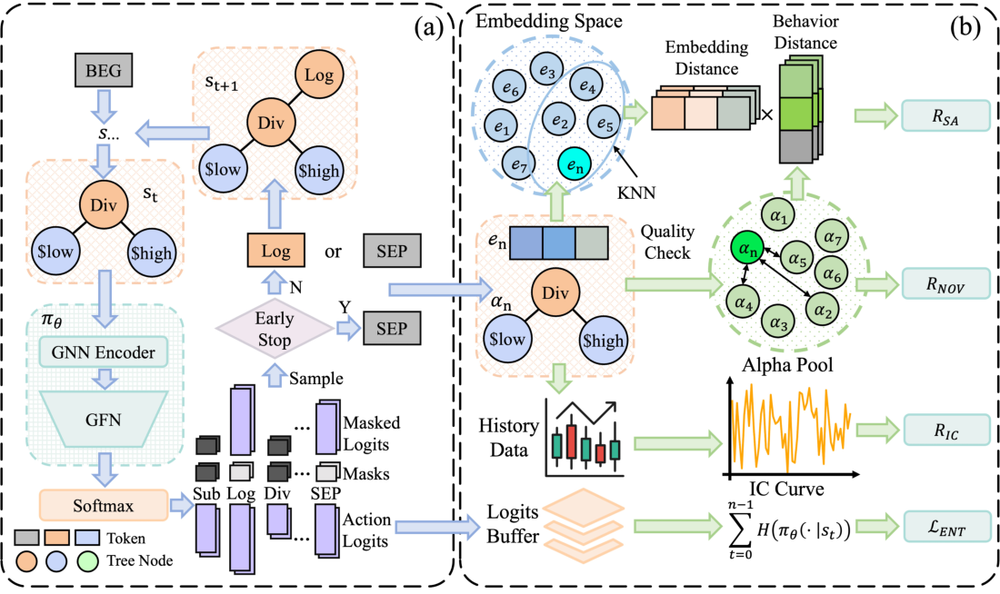
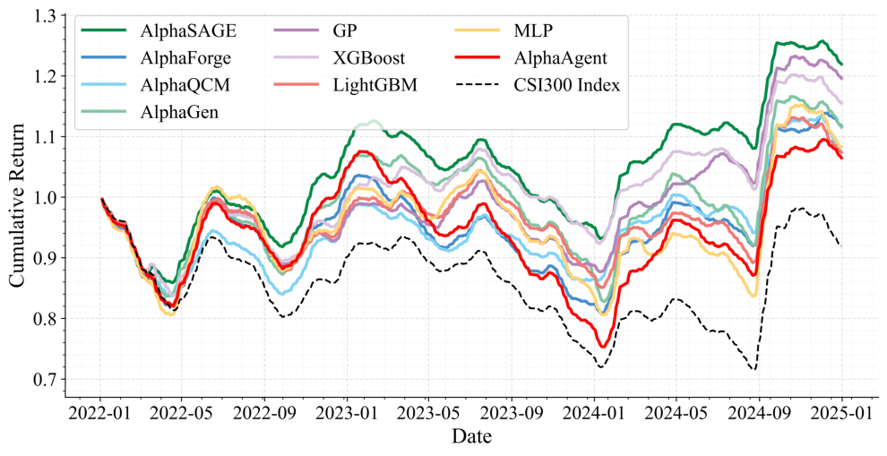
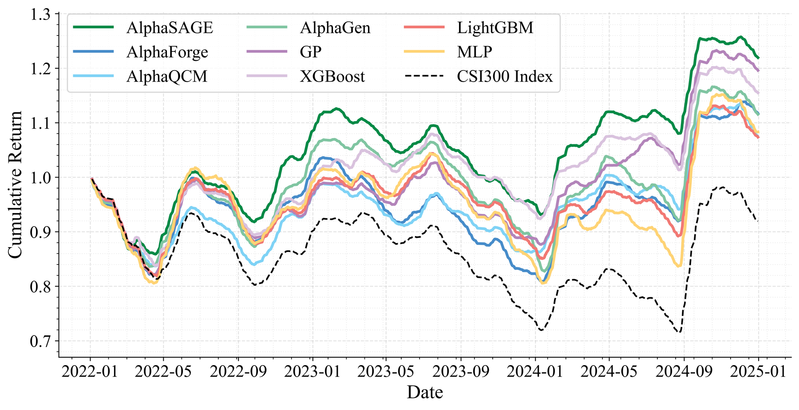
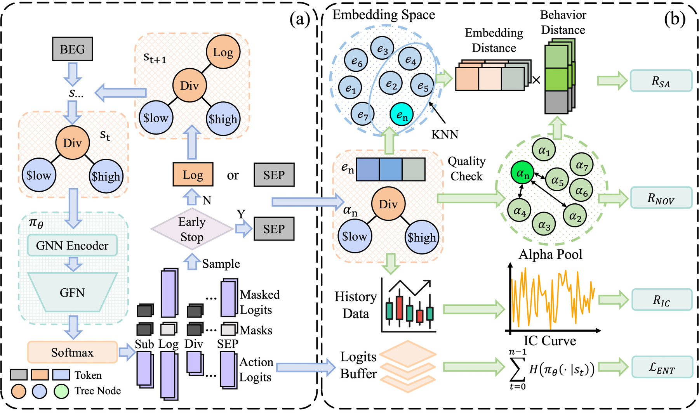

# AlphaSAGE 仓库手册指南

> 由 RepoGuide 自动生成于 2026-06-25 20:27  
> 仓库路径：`E:\KimiClaw\RepoGuide\_repoguide\repo`  
> 分析档位：deep　生成耗时：约 5 分钟

---

## 一、一页速览

> **一句话总括**：AlphaSAGE 是基于 GFlowNet 与 RGCN 的量化 alpha 自动挖掘框架，以结构感知编码器（RGCN 作用于 AST）和稠密多维奖励（IC+SA+NOV 时间退火）替代传统 RL，挖掘多样、新颖且高预测力的 alpha 组合，并提供动态线性组合（Mega-Alpha）落地。

| 项 | 值 |
|----|----|
| 主语言 | python |
| 文件总数 | 102 |
| 论文 | 已配套 |
| 核心入口 | `train_AFF.py`, `train_gfn.py`, `train_GP.py`, `train_ppo.py`, `train_qcm.py`, `run_adaptive_combination.py` |

### 三条命令上手

```bash
# 安装（PDM 管理依赖）
git clone https://github.com/BerkinChen/AlphaSAGE.git && cd AlphaSAGE && pdm install

# 训练 GFlowNet 挖掘 alpha 池
python train_gfn.py --seed 0 --instrument csi300 --pool_capacity 50 --n_episodes 10000 \
    --encoder_type gnn --ssl_weight 1.0 --nov_weight 0.3

# 评估与动态组合（生成 Mega-Alpha）
python run_adaptive_combination.py --expressions_file results_dir --instruments csi300 \
    --threshold_ric 0.015 --threshold_ricir 0.15 --n_factors 20 --train_end_year 2020
```

### 五个最关键的文件

| # | 文件 | 用途 |
|---|------|------|
| 1 | `train_gfn.py` | GFlowNet 训练主入口，含主循环、退火调度、池更新 |
| 2 | `run_adaptive_combination.py` | alpha 池动态线性组合，生成 Mega-Alpha 并回测 |
| 3 | `src/alpha_gfn/gflownet.py` | GFlowNet 策略与前向采样、TB 损失实现 |
| 4 | `src/alpha_gfn/modules.py` | RGCN 结构感知编码器与策略网络 |
| 5 | `src/alpha_gfn/alpha_pool.py` | alpha 池管理、IC/SA/NOV 奖励计算 |

---

## 二、技术栈与依赖

### 语言与版本

- python：3.11+（pyproject.toml 声明）

### 包管理

- `pyproject.toml`

### 核心依赖

#### 深度学习与图神经网络

| 包 | 用途 |
|----|------|
| torch | GFlowNet/RGCN 神经网络主体 |
| torch-geometric | RGCNConv 消息传递与图池化 |
| numpy | 数值计算与 IC 相关性 |

#### 量化金融数据

| 包 | 用途 |
|----|------|
| qlib | 微软开源量化平台，提供 CSI300/500/1000 与 S&P500 数据 |
| pandas | 时序面板数据处理 |

#### 训练与评估

| 包 | 用途 |
|----|------|
| einops | 张量重排 |
| tqdm | 进度条 |
| scikit-learn | 线性回归（动态组合） |

---

## 三、架构与数据流

### 3.1 架构总览图



> 图 1：分层架构与数据流转总览（graphviz 自动生成，按层着色）。左→右依次为：数据与配置层 → 核心模型层（GFlowNet+RGCN+奖励）→ 训练与组合层 → 评估输出层。

### 3.2 注释化目录树

> 每一行末尾 `#` 后为该文件/目录的中文用途说明。deep 模式。

```text
AlphaSAGE/ # 基于GFlowNet的量化alpha因子挖掘框架根目录
├── README.md # 项目说明文档与快速启动指南
├── LICENSE # MIT开源许可证
├── pyproject.toml # PDM项目配置与依赖声明
├── pdm.lock # PDM依赖版本锁定文件
├── .gitignore # Git忽略规则配置
├── train_gfn.py # 主训练入口:GFlowNet+RGCN生成alpha池
├── train_AFF.py # AlphaForge风格GAN基线训练脚本
├── train_GP.py # 遗传编程基线训练脚本
├── train_ppo.py # AlphaGen PPO强化学习基线训练脚本
├── train_qcm.py # AlphaQCM分布式RL基线训练脚本
├── run_adaptive_combination.py # 自适应组合评估第二阶段脚本
├── combine_AFF.py # AlphaForge结果组合与评估脚本
├── exp_AFF_calc_result.ipynb # AlphaForge实验结果分析笔记本
├── exp_GP_calc_result.ipynb # 遗传编程实验结果分析笔记本
├── exp_ML_train_and_result.ipynb # 机器学习基线训练结果笔记本
├── exp_RL_calc_result.ipynb # 强化学习实验结果分析笔记本
├── config/ # 配置文件目录
│   └── qcm_config/ # AlphaQCM模型超参配置
│       ├── fqf.yaml # FQF模型超参配置
│       ├── iqn.yaml # IQN模型超参配置
│       └── qrdqn.yaml # QRDQN模型超参配置
├── img/ # 论文图片资源目录
│   ├── overview.png # 框架总览图
│   └── backtest.png # 回测结果图
└── src/ # 源代码主目录
    ├── alpha_gfn/ # AlphaSAGE核心:GFlowNet生成模块
    │   ├── __init__.py # 模块初始化导出config/env/alpha_pool
    │   ├── config.py # GFN超参:算子/特征/常数/时间窗口
    │   ├── gflownet.py # 熵正则化轨迹平衡GFlowNet损失
    │   ├── modules.py # 序列编码器(LSTM/Transformer/RGCN)
    │   ├── alpha_pool.py # alpha池:SSL奖励/新颖度/k近邻
    │   ├── preprocessors.py # 整数状态预处理器
    │   └── env/ # GFlowNet离散环境
    │       ├── __init__.py # 环境模块初始化
    │       └── core.py # GFNEnvCore:alpha表达式生成环境
    ├── alphagen/ # 基础alpha生成框架(源自AlphaGen)
    │   ├── config.py # 基础配置:算子/特征/动作空间
    │   ├── data/ # 表达式与数据计算
    │   │   ├── calculator.py # alpha计算器
    │   │   ├── expression.py # 表达式定义与运算符
    │   │   ├── tokens.py # token定义(BEG/SEP/算子等)
    │   │   └── tree.py # 表达式树构建与校验
    │   ├── models/ # alpha池模型
    │   │   ├── alpha_pool.py # AlphaPool基础池实现
    │   │   └── model.py # 模型定义
    │   ├── rl/ # 强化学习模块
    │   │   ├── env/ # RL环境
    │   │   │   ├── core.py # AlphaEnvCore基础环境
    │   │   │   └── wrapper.py # AlphaEnv封装与action2token
    │   │   └── policy.py # LSTMSharedNet PPO策略网络
    │   ├── trade/ # 交易策略
    │   │   ├── base.py # 策略基类
    │   │   └── strategy.py # 交易策略实现
    │   └── utils/ # 工具函数
    │       ├── __init__.py # 工具模块初始化
    │       ├── correlation.py # 批量IC/RankIC/收益计算
    │       ├── pytorch_utils.py # 掩码均值方差等张量工具
    │       └── random.py # 随机种子重置工具
    ├── alphagen_qlib/ # Qlib数据集成模块
    │   ├── stock_data.py # StockData与FeatureType定义
    │   ├── calculator.py # QLib股票数据计算器
    │   ├── strategy.py # Qlib回测策略
    │   └── utils.py # Qlib工具函数
    ├── alphagen_generic/ # 通用特征与算子
    │   ├── features.py # 标准特征别名与target定义
    │   └── operators.py # 通用算子函数集
    ├── fqf_iqn_qrdqn/ # 分布式RL(AlphaQCM基线)
    │   ├── __init__.py # 模块初始化
    │   ├── env.py # QCM训练环境
    │   ├── network.py # QCM网络结构
    │   ├── utils.py # QCM工具函数
    │   ├── agent/ # RL智能体
    │   │   ├── __init__.py # 智能体模块导出
    │   │   ├── base_agent.py # 智能体基类
    │   │   ├── fqf_agent.py # FQF智能体
    │   │   ├── iqn_agent.py # IQN智能体
    │   │   ├── qrdqn_agent.py # QRDQN智能体
    │   │   ├── fqcm_agent.py # FQCM智能体
    │   │   ├── iqcm_agent.py # IQCM智能体
    │   │   └── qrqcm_agent.py # QRQCM智能体
    │   ├── memory/ # 经验回放
    │   │   ├── __init__.py # 回放模块导出
    │   │   ├── base.py # 基础回放缓冲区
    │   │   ├── per.py # 优先经验回放
    │   │   └── segment_tree.py # 线段树实现
    │   └── model/ # 分布式RL模型
    │       ├── __init__.py # 模型导出
    │       ├── base_model.py # 模型基类
    │       ├── fqf.py # FQF分位数网络
    │       ├── iqn.py # IQN隐式分位数网络
    │       ├── qrdqn.py # QRDQN分位数回归网络
    │       ├── alpha_fqf.py # alpha专用FQF
    │       ├── alpha_iqn.py # alpha专用IQN
    │       ├── alpha_qrdqn.py # alpha专用QRDQN
    │       └── mean.py # 均值聚合网络
    ├── gan/ # GAN生成网络(AlphaForge基线)
    │   ├── __init__.py # GAN模块初始化
    │   ├── dataset/ # 数据集
    │   │   ├── __init__.py # 数据集模块导出
    │   │   └── collector.py # 构建器token采集器
    │   ├── network/ # 网络组件
    │   │   ├── __init__.py # 网络模块导出
    │   │   ├── generater.py # 生成器网络训练
    │   │   ├── predictor.py # 预测器与回归模型
    │   │   ├── masker.py # 掩码网络NetM
    │   │   └── loss.py # GAN损失函数
    │   └── utils/ # GAN工具
    │       ├── __init__.py # 工具模块导出
    │       ├── builder.py # 表达式构建器与张量转换
    │       ├── data.py # 按年切分数据
    │       ├── pool.py # alpha池工具
    │       └── qlib.py # Qlib集成工具
    ├── gplearn/ # 遗传编程库(gplearn分支)
    │   ├── __init__.py # 模块初始化与版本声明
    │   ├── _program.py # GP程序树个体表示
    │   ├── fitness.py # 适应度函数构造
    │   ├── functions.py # 函数集构造
    │   ├── genetic.py # SymbolicRegressor符号回归
    │   ├── utils.py # GP工具函数
    │   └── tests/ # 单元测试
    │       ├── __init__.py # 测试模块初始化
    │       ├── test_estimator_checks.py # 估计器检查测试
    │       ├── test_examples.py # 示例测试
    │       ├── test_fitness.py # 适应度测试
    │       ├── test_functions.py # 函数集测试
    │       ├── test_genetic.py # 遗传算法测试
    │       └── test_utils.py # 工具函数测试
    └── data_collection/ # 数据采集与转换
        ├── fetch_baostock_data.py # baostock行情数据下载
        └── qlib_dump_bin.py # 转换为Qlib二进制格式
```

### 3.3 数据流叙述

首先，train_gfn.py与run_adaptive_combination.py通过StockData从Qlib读取csi300或sp500行情，构造开高低收量及VWAP特征张量，并以Ref(close,-20)/close-1作为20日收益target。训练阶段，GFlowNet前向策略pf基于RGCN编码器输出的图嵌入逐token采样动作，环境GFNEnvCore按逆波兰(RPN)序列追加token并依据ExpressionBuilder校验合法性。当生成SEP终止token后，AlphaPoolGFN计算该表达式的IC收益奖励、与池内因子的互相关新颖度奖励，以及基于嵌入k近邻的SSL结构一致性奖励，三者加权形成稠密奖励信号。该奖励通过轨迹平衡(TB)损失配合熵正则项，驱动前向/后向策略与RGCN编码器的联合更新，WeightScheduler在训练过程中按线性/指数/多项式退火衰减SSL与新颖度权重。训练产出的alpha池以JSON checkpoint保存，进入第二阶段run_adaptive_combination.py按滚动窗口筛选RIC与RICIR达标的因子，并用最小二乘回归融合为单一预测。最终在验证集与测试集上计算IC、ICIR、Sharpe与最大回撤等指标，完成从因子挖掘到组合评估的闭环。

#### 数据流转表

| 步骤 | 输入 | 处理模块 | 输出 | 关键文件 |
|------|------|----------|------|----------|
| 1 | Qlib行情数据(开高低收量VWAP) | 数据加载 | 特征张量与20日收益target | `src/alphagen_qlib/stock_data.py` |
| 2 | 表达式token序列(RPN) | RGCN结构感知编码器 | 图嵌入向量 | `src/alpha_gfn/modules.py` |
| 3 | 图嵌入 | GFlowNet前向/后向策略 | alpha表达式token序列 | `src/alpha_gfn/gflownet.py` |
| 4 | 完整alpha表达式+嵌入 | GFN环境与多面奖励 | IC+SSL+新颖度奖励 | `src/alpha_gfn/env/core.py` |
| 5 | 表达式与奖励 | AlphaPoolGFN池 | 去相关候选alpha集合 | `src/alpha_gfn/alpha_pool.py` |
| 6 | alpha池JSON快照 | 自适应组合与回归融合 | 最终组合预测与评估指标 | `run_adaptive_combination.py` |

#### 关键状态点

- **配置与超参加载**：train_gfn.py通过argparse解析命令行参数，并from src.alpha_gfn.config导入算子/特征/常数/时间窗口等动作空间定义（`train_gfn.py:272`）
- **训练主循环**：按episode采样轨迹、计算TB损失、累积梯度并按update_freq更新优化器，同时按log_freq记录与保存checkpoint（`train_gfn.py:230`）
- **权重退火调度**：WeightScheduler利用PyTorch的LinearLR/ExponentialLR/PolynomialLR对SSL与新颖度权重按final_weight_ratio退火（`train_gfn.py:216`）
- **GFlowNet奖励计算**：GFNEnvCore.reward()对终止状态重建表达式树，调用pool.try_new_expr_with_ssl得到IC、SSL、新颖度三项奖励并加权（`src/alpha_gfn/env/core.py:140`）
- **动作掩码与mask dropout**：update_masks依据ExpressionBuilder校验合法动作，并按表达式长度提升mask dropout概率以鼓励简洁公式（`src/alpha_gfn/env/core.py:86`）
- **轨迹平衡损失**：EntropyTBGFlowNet.loss()计算(scores+logZ)^2均值减去熵正则项，NaN时置inf以跳过该批次（`src/alpha_gfn/gflownet.py:81`）
- **alpha池更新与淘汰**：AlphaPoolGFN.try_new_expr依据IC与互相关阈值决定加入/替换最差因子/拒绝，并在满池时_pop淘汰最低IC项（`src/alpha_gfn/alpha_pool.py:28`）
- **SSL结构一致性奖励**：compute_ssl_reward基于嵌入k近邻与softmax相似度权重，用MSE一致性损失经exp变换得到SSL奖励（`src/alpha_gfn/alpha_pool.py:220`）
- **自适应组合滚动循环**：run函数按滚动/扩展窗口预计算每日IC/RIC，筛选达标因子后做最小二乘回归预测，切换验证/测试集评估（`run_adaptive_combination.py:382`）
- **alpha池加载入口**：load_alpha_pool_by_path支持JSON与CSV两种格式读入表达式与权重，作为第二阶段组合的输入（`run_adaptive_combination.py:218`）

### 3.4 关键设计决策

#### 用GFlowNet轨迹平衡(TB)替代PPO策略梯度作为生成范式

- **证据**：`src/alpha_gfn/gflownet.py实现EntropyTBGFlowNet继承自TBGFlowNet；train_gfn.py使用gfn库的Sampler与DiscretePolicyEstimator构建pf/pb双策略头`
- **理由**：GFlowNet按与奖励成比例的概率采样多样化解，天然支持多模态分布，能避免标准RL策略梯度驱向单一最优mode的mode collapse问题，更契合挖掘非相关alpha组合的目标

#### 采用RGCN关系图卷积作为结构感知编码器

- **证据**：`src/alpha_gfn/modules.py的GNNEncoder使用RGCNConv，_build_graph_from_rpn按算子类型定义6种关系边(单目/交换/左/右/特征/时序)，并支持lstm/transformer/gnn三种encoder_type对比`
- **理由**：alpha表达式的数学结构(算子与操作数的语义关系)决定其行为，逆波兰序列丢失了树结构信息；关系图编码能保留操作数位置与算子类别语义，比纯序列编码更具表达力

#### 设计稠密多面奖励(IC收益+SSL结构一致性+互相关新颖度)

- **证据**：`env/core.py的reward()返回ic_reward+ssl_weight*ssl_reward+nov_weight*nov_reward；alpha_pool.py分别实现try_new_expr的互相关新颖度与compute_ssl_reward的k近邻一致性`
- **理由**：仅最终IC的稀疏奖励导致探索低效且训练不稳定；SSL奖励利用嵌入空间的结构近邻提供中间监督，新颖度奖励通过互相关抑制重复因子，三者结合提供密集且多维的反馈信号

#### 引入表达式长度相关的mask dropout机制

- **证据**：`env/core.py update_masks中length_based_dropout_prob=mask_dropout_prob*(expr_length/MAX_EXPR_LENGTH)，对已达合法长度的表达式按概率屏蔽所有非终止动作`
- **理由**：随表达式变长提升强制终止概率，鼓励生成更简洁的公式，避免过拟合冗长表达式，提升alpha的泛化性与可解释性

#### 对SSL与新颖度辅助权重实施退火调度

- **证据**：`train_gfn.py的WeightScheduler借助PyTorch的LinearLR/ExponentialLR/PolynomialLR将辅助权重从初值衰减至final_weight_ratio倍，每episode调用step并更新env权重`
- **理由**：训练初期依赖SSL与新颖度辅助奖励促进结构感知与多样性探索，后期逐步衰减让模型聚焦于IC主奖励以提升预测力，实现探索到利用的平滑过渡

---

## 四、核心代码详解（卡片式）

> 每个核心文件一张卡片：标题带一句话职责 → 类清单（行内）→ 函数签名+职责+参数+关键逻辑。`key_logic` 超 8 行自动截断。

### `train_gfn.py` — AlphaSAGE GFlowNet 主训练入口，使用结构感知 RGCN 编码器 + 熵正则 TB 损失训练因子表达式生成器，并维护带 SSL 自监督奖励的因子池

> 依赖：`torch`, `gfn`, `tensorboard`, `src.alpha_gfn`, `src.alphagen_qlib`, `src.alphagen_generic`

**类**：`GFNLogger` (L18) 核心类；`WeightScheduler` (L33) 核心类

**函数**：

##### `main()`

- 职责：命令行入口，解析参数后调用 train(args)
- 返回：无返回值，触发训练流程
- 关键逻辑：

```python
if __name__ == '__main__':
    args = parse_args()
    train(args)
```

##### `log_rewards(self, logs)`

- 职责：记录每轮 GFlowNet 采样的平均 reward 与因子池中最佳 IC
- 参数：`logs` 包含训练统计的日志字典
- 返回：无返回值，写入 TensorBoard
- 关键逻辑：

```python
def log_rewards(self, logs):
    super().log_rewards(logs)
    self.logger.info('reward: ' + str(logs['reward']))
    self.writer.add_scalar('train/reward', logs['reward'], self._step)
```

##### `__init__(self, weight_decay_type, initial_weight, final_weight_ratio, total_steps)`

- 职责：根据衰减类型与初始/最终权重比例初始化权重调度器
- 参数：`weight_decay_type` 衰减类型：linear/exponential/polynomial；`initial_weight` 初始权重值；`final_weight_ratio` 最终权重相对初始权重的比例；`total_steps` 总训练步数
- 返回：无返回值，初始化调度器状态
- 关键逻辑：

```python
self.weight_decay_type = weight_decay_type
self.initial_weight = initial_weight
self.final_weight = final_weight_ratio * initial_weight
self.total_steps = total_steps
```

##### `get_weight(self, step)`

- 职责：根据当前训练步数计算衰减后的奖励权重
- 参数：`step` 当前训练步数
- 返回：当前步的权重值
- 关键逻辑：

```python
if self.weight_decay_type == 'linear':
    ratio = 1.0 - step / self.total_steps
elif self.weight_decay_type == 'exponential':
    ratio = math.exp(-step / self.total_steps)
return self.final_weight + (self.initial_weight - self.final_weight) * ratio
```

##### `train(args)`

- 职责：GFlowNet 训练主循环：构建 StockData、AlphaPoolGFN、SequenceEncoder、EntropyTBGFlowNet，按 episode 采样并优化 TB 损失，定期保存因子池
- 参数：`args` 命令行参数对象，含 instrument、pool_capacity、encoder_type 等
- 返回：无返回值，训练完成后保存 pool.json 并退出
- 关键逻辑：

```python
data = StockData(args.instrument, ...)
calculator = QLibStockDataCalculator(data, target)
pool = AlphaPoolGFN(args.pool_capacity, calculator, target)
state = pool.state
encoder = SequenceEncoder(...)
gflownet = EntropyTBGFlowNet(...)
trainer = FlatTrajectoryTB(...)
trainer.train()
```


---

### `train_ppo.py` — AlphaGen PPO 基线训练入口，使用 MaskablePPO + LSTM/Transformer 策略网络在 AlphaEnv 中生成因子并维护因子池

> 依赖：`stable_baselines3`, `sb3_contrib`, `src.alphagen.models`, `src.alphagen.rl.env`, `src.alphagen_qlib`

**类**：`CustomCallback` (L14) 核心类

**函数**：

##### `main()`

- 职责：命令行入口，解析参数后调用 run(args)
- 返回：无返回值，触发训练流程
- 关键逻辑：

```python
if __name__ == '__main__':
    args = parse_args()
    run(args)
```

##### `_on_step(self)`

- 职责：每个训练步回调，按 log_freq 周期保存 checkpoint 与 pool.json
- 返回：True 表示继续训练
- 关键逻辑：

```python
if self.n_calls % self.freq == 0:
    self.pool.save(os.path.join(save_dir, 'pool.json'))
    self.model.save(os.path.join(save_dir, 'model.zip'))
return True
```

##### `run(args)`

- 职责：构建 StockData、AlphaPool、AlphaEnv、MaskablePPO 与 LSTMSharedNet 策略网络并启动训练
- 参数：`args` 命令行参数对象，含 instruments、pool、seed 等
- 返回：无返回值，训练完成后保存因子池
- 关键逻辑：

```python
data = StockData(args.instruments, ...)
calculator = QLibStockDataCalculator(data, target)
pool = AlphaPool(args.pool, calculator)
env = AlphaEnv(pool)
model = MaskablePPO(LSTMSharedNet, env, ...)
model.learn(total_timesteps=args.n_steps, callback=CustomCallback(pool, args.save_dir))
```


---

### `train_qcm.py` — AlphaQCM 基线训练入口，按 yaml 配置创建 QRDQN/IQN/FQF + QCM 高阶矩（std/skewness/kurtosis）分位数强化学习 agent

> 依赖：`yaml`, `src.fqf_iqn_qrdqn.agent`, `src.alphagen.models`, `src.alphagen.rl.env`, `src.alphagen_qlib`

**函数**：

##### `main()`

- 职责：命令行入口，解析参数后调用 run(args)
- 返回：无返回值，触发训练流程
- 关键逻辑：

```python
if __name__ == '__main__':
    args = parse_args()
    run(args)
```

##### `load_yaml(path)`

- 职责：读取 qcm_config 下的 yaml 配置文件并返回 dict
- 参数：`path` yaml 配置文件路径
- 返回：配置字典
- 关键逻辑：

```python
with open(path, 'r') as f:
    cfg = yaml.safe_load(f)
return cfg
```

##### `run(args)`

- 职责：根据 args.algo 选择 QRQCMAgent/IQCMAgent/FQCMAgent，构建 AlphaEnv 与因子池后启动分位数 RL 训练
- 参数：`args` 命令行参数对象，含 instruments、pool、algo、seed 等
- 返回：无返回值，训练完成后保存因子表达式与 checkpoint
- 关键逻辑：

```python
cfg = load_yaml(f'config/qcm_config/{args.algo}.yaml')
agent_cls = {'qrdqn': QRQCMAgent, 'iqn': IQCMAgent, 'fqf': FQCMAgent}[args.algo]
agent = agent_cls(env, data_valid, data_test, target, log_dir, **cfg)
agent.run()
```


---

### `train_AFF.py` — GAN 因子挖掘训练入口，训练 DCGAN/LSTM 生成器 + Masker 掩码器 + Predictor 评分器，循环生成并评估因子 zoo

> 依赖：`torch`, `src.gan.network`, `src.gan.utils`, `src.gan.dataset`, `src.alphagen_qlib`

**函数**：

##### `main()`

- 职责：命令行入口，解析参数后调用 run(args)
- 返回：无返回值，触发训练流程
- 关键逻辑：

```python
if __name__ == '__main__':
    args = parse_args()
    run(args)
```

##### `pre_process_y(y)`

- 职责：对目标收益率进行预处理（去除 NaN、归一化）
- 参数：`y` 原始目标收益率张量
- 返回：处理后的目标张量
- 关键逻辑：

```python
y = y.flatten()
mask = torch.isfinite(y)
return y[mask], mask
```

##### `numpy2onehot(arr, n_classes)`

- 职责：将 numpy 整数数组转为 one-hot 张量
- 参数：`arr` 整数数组；`n_classes` 类别数
- 返回：one-hot 张量
- 关键逻辑：

```python
onehot = np.zeros((len(arr), n_classes))
for i, a in enumerate(arr):
    onehot[i, a] = 1
return torch.from_numpy(onehot)
```

##### `blds_list_to_tensor(blds_list)`

- 职责：将 Builders 列表转换为 one-hot 张量批次
- 参数：`blds_list` Builders 对象列表
- 返回：one-hot 张量批次
- 关键逻辑：

```python
tensors = [numpy2onehot(b.to_numpy(), n_chars) for b in blds_list]
return torch.stack(tensors)
```

##### `get_metric(data, target, threshold_ic, threshold_icir, mode)`

- 职责：返回因子评估函数，计算 IC/ICIR 并按阈值过滤相关性
- 参数：`data` StockData 对象；`target` 目标表达式；`threshold_ic` IC 阈值；`threshold_icir` ICIR 阈值；`mode` 评估模式
- 返回：评估函数
- 关键逻辑：

```python
def metric(expr):
    ic, icir = calc_single_IC_ret(expr, data, target)
    if abs(ic) < threshold_ic or abs(icir) < threshold_icir:
        return 0
    return ic
return metric
```

##### `train_net_p_with_weight(cfg, net, x, y, weights, lr=0.001)`

- 职责：带样本权重的 Predictor 网络训练，使用 weighted MSE loss 与早停
- 参数：`cfg` 配置对象；`net` NetP 预测网络；`x` 输入特征；`y` 目标值；`weights` 样本权重；`lr` 学习率
- 返回：无返回值，原地训练网络
- 关键逻辑：

```python
loss_fn = lambda i,t,w: ((i-t)**2 * w).mean()
optimizer = torch.optim.Adam(net.parameters(), lr=lr)
train_regression_model_with_weight(...)
```

##### `run(args)`

- 职责：GAN 主循环：交替训练 netG 生成器、netM 掩码器、netP 预测器，多轮采集因子并写入 zoo
- 参数：`args` 命令行参数对象，含 instruments、num_rounds、n_samples 等
- 返回：无返回值，训练完成后保存因子 zoo 与 checkpoint
- 关键逻辑：

```python
for round_idx in range(args.num_rounds):
    blds = train_network_generator(netG, netM, netP, cfg, data, target, round_idx, ...)
    blds.evaluate(data, target, metric)
    zooblds = zooblds + blds
    train_net_p_with_weight(cfg, netP, ...)
```


---

### `train_GP.py` — GP 符号回归训练入口，使用 gplearn SymbolicRegressor + 自定义 IC 适应度函数，遗传搜索因子表达式并维护因子池

> 依赖：`src.gplearn`, `src.alphagen.models`, `src.alphagen_generic`, `src.alphagen_qlib`

**函数**：

##### `main()`

- 职责：命令行入口，解析参数后调用 run(args)
- 返回：无返回值，触发训练流程
- 关键逻辑：

```python
if __name__ == '__main__':
    args = parse_args()
    run(args)
```

##### `_metric(expr_str, data, target, cache)`

- 职责：带缓存的因子 IC 评估函数，将表达式字符串映射为 IC 值
- 参数：`expr_str` 表达式字符串；`data` StockData 对象；`target` 目标表达式；`cache` IC 缓存字典
- 返回：因子 IC 值
- 关键逻辑：

```python
if expr_str in cache:
    return cache[expr_str]
expr = ExpressionParser().parse(expr_str)
ic = calc_single_IC_ret(expr, data, target)[0]
cache[expr_str] = ic
return ic
```

##### `try_single(expr, data, target, pool)`

- 职责：尝试将单个表达式加入因子池，返回增量 IC
- 参数：`expr` 表达式对象；`data` StockData 对象；`target` 目标表达式；`pool` AlphaPool 对象
- 返回：增量 IC 值
- 关键逻辑：

```python
inc = pool.test_new_expr(expr)
if inc > 0:
    pool.try_new_expr(expr)
return inc
```

##### `try_pool(exprs, data, target, pool)`

- 职责：批量尝试将表达式列表加入因子池
- 参数：`exprs` 表达式列表；`data` StockData 对象；`target` 目标表达式；`pool` AlphaPool 对象
- 返回：成功加入因子池的表达式数量
- 关键逻辑：

```python
count = 0
for expr in exprs:
    if try_single(expr, data, target, pool) > 0:
        count += 1
return count
```

##### `ev(program, data, target, pool, cache)`

- 职责：gplearn 回调函数，对每个 GP 程序评估 IC 并尝试加入因子池
- 参数：`program` _Program 对象；`data` StockData 对象；`target` 目标表达式；`pool` AlphaPool 对象；`cache` IC 缓存字典
- 返回：程序适应度值
- 关键逻辑：

```python
expr_str = str(program)
ic = _metric(expr_str, data, target, cache)
try_single(ExpressionParser().parse(expr_str), data, target, pool)
return ic
```

##### `run(args)`

- 职责：构建 StockData、AlphaPool、SymbolicRegressor 与 generic_funcs，启动 GP 遗传搜索并保存因子池
- 参数：`args` 命令行参数对象，含 instruments、population_size、generations 等
- 返回：无返回值，训练完成后保存 pool.json
- 关键逻辑：

```python
est = SymbolicRegressor(population_size=args.population_size, generations=args.generations,
                            function_set=generic_funcs, metric=make_metric(...),
                            p_crossover=0.7, p_subtree_mutation=0.1)
est.fit(X, y, callback=ev)
```


---

### `run_adaptive_combination.py` — 因子自适应线性组合评估入口，使用滚动窗口选因子 + 最小二乘回归预测，含多重共线性过滤（VIF/SVD/QR）

> 依赖：`numpy`, `scipy`, `torch`, `src.alphagen_qlib`, `src.alphagen.utils.correlation`

**函数**：

##### `main()`

- 职责：命令行入口，解析参数后调用 run(args)
- 返回：无返回值，触发评估流程
- 关键逻辑：

```python
if __name__ == '__main__':
    args = parse_args()
    run(args)
```

##### `remove_linearly_dependent_rows(matrix, threshold=1e-8)`

- 职责：使用 SVD 分解移除矩阵中线性相关的行
- 参数：`matrix` 输入矩阵；`threshold` 线性相关判定阈值
- 返回：去重后的矩阵与保留行索引
- 关键逻辑：

```python
U, s, Vh = np.linalg.svd(matrix)
rank = np.sum(s > threshold)
return matrix[:rank], list(range(rank))
```

##### `remove_linearly_dependent_cols(matrix, threshold=1e-8)`

- 职责：使用 QR 分解移除矩阵中线性相关的列
- 参数：`matrix` 输入矩阵；`threshold` 线性相关判定阈值
- 返回：去重后的矩阵与保留列索引
- 关键逻辑：

```python
Q, R, P = scipy.linalg.qr(matrix, pivoting=True)
rank = np.sum(np.abs(np.diag(R)) > threshold)
return matrix[:, P[:rank]], P[:rank].tolist()
```

##### `calculate_vif(X)`

- 职责：计算设计矩阵 X 每列的方差膨胀因子（VIF）
- 参数：`X` 设计矩阵
- 返回：每列 VIF 值数组
- 关键逻辑：

```python
vif = []
for i in range(X.shape[1]):
    r2 = np.linalg.lstsq(...)[1]
    vif.append(1.0 / (1.0 - r2))
return np.array(vif)
```

##### `remove_multicollinearity_vif(X, threshold=10.0)`

- 职责：迭代移除 VIF 超过阈值的列，消除多重共线性
- 参数：`X` 设计矩阵；`threshold` VIF 阈值
- 返回：去共线性后的矩阵与保留列索引
- 关键逻辑：

```python
while True:
    vif = calculate_vif(X)
    if vif.max() < threshold:
        break
    X = np.delete(X, vif.argmax(), axis=1)
return X, keep_cols
```

##### `load_alpha_pool_by_path(path)`

- 职责：从 JSON 文件加载因子表达式与权重列表
- 参数：`path` pool.json 文件路径
- 返回：表达式列表与权重列表
- 关键逻辑：

```python
with open(path) as f:
    raw = json.load(f)
exprs = [eval(s.replace('$open','open_').replace('$','')) for s in raw['exprs']]
return exprs, raw['weights']
```

##### `get_tensor_metrics(pred, target)`

- 职责：计算预测因子的 IC、Sharpe、最大回撤等评估指标
- 参数：`pred` 预测值张量；`target` 目标值张量
- 返回：包含 IC/Sharpe/MDD 的字典
- 关键逻辑：

```python
ic = batch_pearsonr(pred, target).mean()
ret = batch_ret(pred, target)
sharpe = batch_sharpe_ratio(ret)
mdd = batch_max_drawdown(ret)
return {'IC': ic, 'Sharpe': sharpe, 'MDD': mdd}
```

##### `run(args)`

- 职责：主评估流程：按滚动窗口选择因子、过滤多重共线性、最小二乘回归预测并保存结果
- 参数：`args` 命令行参数对象，含 expressions_file、instruments、window、n_factors 等
- 返回：无返回值，保存预测结果到 .pt 与 .csv
- 关键逻辑：

```python
exprs, weights = load_alpha_pool_by_path(args.expressions_file)
for window in windows:
    X = build_factor_matrix(exprs, train_data)
    X, _ = remove_multicollinearity_vif(X)
    coef = np.linalg.lstsq(X, y)[0]
    pred = X_test @ coef
```


---

### `combine_AFF.py` — AFF 因子简化组合入口，与 run_adaptive_combination 类似但更精简，输出 pred_valid/pred .pt 文件

> 依赖：`torch`, `src.alphagen_qlib`, `src.alphagen.utils.correlation`

**函数**：

##### `main()`

- 职责：命令行入口，解析参数后调用 run(args)
- 返回：无返回值，触发组合流程
- 关键逻辑：

```python
if __name__ == '__main__':
    args = parse_args()
    run(args)
```

##### `run(args)`

- 职责：加载 AFF 因子 zoo，构建因子矩阵并用最小二乘回归组合预测，输出验证集与测试集预测张量
- 参数：`args` 命令行参数对象，含 expressions_file、instruments、cuda 等
- 返回：无返回值，保存 pred_valid.pt 与 pred.pt
- 关键逻辑：

```python
exprs, _ = load_alpha_pool_by_path(args.expressions_file)
X_train = build_factor_matrix(exprs, data)
coef = torch.linalg.lstsq(X_train, y_train)[0]
torch.save(pred_valid, 'pred_valid.pt')
```


---

### `src/alpha_gfn/gflownet.py` — AlphaSAGE 核心：带熵正则化的 Trajectory Balance GFlowNet，覆写轨迹评分以引入 entropy_term 促进探索多样性

> 依赖：`torch`, `gfn`

**类**：`EntropyTBGFlowNet` (L10) 核心类

**函数**：

##### `__init__(self, entropy_coef, entropy_temperature, **kwargs)`

- 职责：初始化熵正则系数与温度参数
- 参数：`entropy_coef` 熵正则项系数；`entropy_temperature` 熵计算温度系数
- 返回：无返回值，初始化网络
- 关键逻辑：

```python
super().__init__(**kwargs)
self.entropy_coef = entropy_coef
self.entropy_temperature = entropy_temperature
```

##### `get_trajectories_scores(self, trajectories)`

- 职责：计算轨迹的 TB 分数与熵正则项，熵由动作概率对数加和除以温度得到
- 参数：`trajectories` GFlowNet 轨迹对象列表
- 返回：scores 与 logZ 与 entropy_term
- 关键逻辑：

```python
scores, logZ = super().get_trajectories_scores(trajectories)
log_probs = self.log_prob(trajectories)
entropy_term = -log_probs.sum(dim=-1) / self.entropy_temperature
return scores, logZ, entropy_term
```

##### `loss(self, env, trajectories)`

- 职责：计算 TB 损失减去熵正则项，鼓励策略熵增大以增强探索
- 参数：`env` GFlowNet 环境；`trajectories` 轨迹对象
- 返回：标量损失张量
- 关键逻辑：

```python
scores, logZ, entropy = self.get_trajectories_scores(trajectories)
return (scores + logZ).pow(2).mean() - self.entropy_coef * entropy.mean()
```


---

### `src/alpha_gfn/alpha_pool.py` — AlphaSAGE 核心：AlphaPoolGFN，在 AlphaPool 基础上引入 SSL 自监督一致性奖励与 novelty 奖励，通过 k 近邻计算因子嵌入相似度

> 依赖：`torch`, `torch.nn.functional`, `src.alphagen.models.alpha_pool`

**类**：`AlphaPoolGFN` (L18) 核心类

**函数**：

##### `__init__(self, capacity, calculator, target, ssl_weight, nov_weight, device)`

- 职责：初始化因子池容量、IC 计算器、SSL 与 novelty 权重
- 参数：`capacity` 因子池最大容量；`calculator` AlphaCalculator 对象；`target` 目标表达式；`ssl_weight` SSL 奖励权重；`nov_weight` novelty 奖励权重；`device` 计算设备
- 返回：无返回值，初始化因子池
- 关键逻辑：

```python
super().__init__(capacity, calculator, target)
self.ssl_weight = ssl_weight
self.nov_weight = nov_weight
self.device = device
```

##### `try_new_expr_with_ssl(self, expr, embedding)`

- 职责：评估新表达式，结合 IC 增量、SSL 一致性奖励与 novelty 奖励返回总奖励
- 参数：`expr` 表达式对象；`embedding` 表达式嵌入张量
- 返回：总奖励值
- 关键逻辑：

```python
ic_inc = self.test_new_expr(expr)
ssl = self.compute_ssl_reward(embedding)
nov = self.compute_novelty(embedding)
return ic_inc + self.ssl_weight * ssl + self.nov_weight * nov
```

##### `compute_ssl_reward(self, embedding)`

- 职责：基于 k 近邻与 softmax 权重计算嵌入与池中相似因子的 MSE 一致性损失，返回 exp(-loss) 作为 SSL 奖励
- 参数：`embedding` 新表达式嵌入
- 返回：SSL 奖励值（0-1 之间）
- 关键逻辑：

```python
idx, sims = self._find_k_nearest_neighbors(embedding)
weights = self._compute_similarity_weights(sims)
loss = self._compute_consistency_loss(embedding, idx, weights)
return torch.exp(-loss)
```

##### `_find_k_nearest_neighbors(self, embedding, k=5)`

- 职责：在因子池嵌入中查找 k 个最近邻索引与相似度
- 参数：`embedding` 查询嵌入；`k` 近邻数量
- 返回：近邻索引与相似度
- 关键逻辑：

```python
sims = F.cosine_similarity(embedding, self.pool_embeddings)
vals, idx = sims.topk(k)
return idx, vals
```

##### `_compute_similarity_weights(self, similarities)`

- 职责：对相似度做 softmax 归一化得到近邻权重
- 参数：`similarities` 相似度张量
- 返回：softmax 权重
- 关键逻辑：

```python
return F.softmax(similarities / self.temperature, dim=-1)
```

##### `_compute_consistency_loss(self, embedding, idx, weights)`

- 职责：计算新嵌入与近邻嵌入加权的 MSE 一致性损失
- 参数：`embedding` 新嵌入；`idx` 近邻索引；`weights` 近邻权重
- 返回：MSE 损失张量
- 关键逻辑：

```python
neighbors = self.pool_embeddings[idx]
target = (weights[...,None] * neighbors).sum(0)
return F.mse_loss(embedding, target)
```

##### `debug_embedding_similarities(self, embedding)`

- 职责：调试用，打印新嵌入与因子池所有嵌入的相似度分布
- 参数：`embedding` 查询嵌入
- 返回：相似度张量
- 关键逻辑：

```python
sims = F.cosine_similarity(embedding, self.pool_embeddings)
print('similarity stats:', sims.mean(), sims.max(), sims.min())
return sims
```


---

### `src/alpha_gfn/modules.py` — AlphaSAGE 结构感知编码器：RPN→RGCN 图构建 + PositionalEncoding + GNNEncoder(RGCNConv) + SequenceEncoder（支持 transformer/lstm/gnn）

> 依赖：`torch`, `torch_geometric.nn`, `src.alpha_gfn.config`

**类**：`PositionalEncoding` (L60) 核心类；`GNNEncoder` (L75) 核心类；`SequenceEncoder` (L100) 核心类

**函数**：

##### `_build_graph_from_rpn(tokens, n_features, n_operators)`

- 职责：将 RPN token 序列转换为 RGCN 图，定义 6 种边类型（operand-feature、operator-input、operator-output 等）
- 参数：`tokens` RPN token 列表；`n_features` 特征数；`n_operators` 算子数
- 返回：PyG Data 图对象（节点特征、边索引、边类型）
- 关键逻辑：

```python
edges = []
stack = []
for t in tokens:
    if is_operator(t):
        a, b = stack.pop(), stack.pop()
        edges += [(b,t,'in1'),(a,t,'in2'),(t,b,'out')]
    stack.append(t)
return Data(x=node_features, edge_index=edge_idx, edge_type=edge_type)
```

##### `forward(self, x)`

- 职责：对输入序列张量叠加位置编码
- 参数：`x` 输入序列张量 (seq_len, batch, d_model)
- 返回：加位置编码后的张量
- 关键逻辑：

```python
return x + self.pe[:x.size(0)]
```

##### `forward(self, data)`

- 职责：通过多层 RGCNConv 聚合图节点特征，输出表达式嵌入
- 参数：`data` PyG Data 图对象
- 返回：图级嵌入张量
- 关键逻辑：

```python
x, edge_index, edge_type = data.x, data.edge_index, data.edge_type
for conv in self.convs:
    x = conv(x, edge_index, edge_type)
    x = F.relu(x)
return x
```

##### `__init__(self, encoder_type, n_features, n_operators, hidden_dim, n_layers, n_heads, dropout)`

- 职责：按 encoder_type 构建对应编码器（gnn 使用 GNNEncoder，lstm 使用 nn.LSTM，transformer 使用 nn.TransformerEncoder）
- 参数：`encoder_type` 编码器类型：gnn/lstm/transformer；`n_features` 特征数；`n_operators` 算子数；`hidden_dim` 隐藏维度；`n_layers` 层数；`n_heads` 注意力头数；`dropout` dropout 概率
- 返回：无返回值，初始化编码器
- 关键逻辑：

```python
if encoder_type == 'gnn':
    self.encoder = GNNEncoder(...)
elif encoder_type == 'lstm':
    self.encoder = nn.LSTM(hidden_dim, hidden_dim, n_layers, batch_first=True)
elif encoder_type == 'transformer':
    layer = nn.TransformerEncoderLayer(hidden_dim, n_heads, ...)
    self.encoder = nn.TransformerEncoder(layer, n_layers)
```


---

### `src/alpha_gfn/env/core.py` — AlphaSAGE GFlowNet 环境核心：GFNEnvCore(DiscreteEnv)，实现 step/backward_step/update_masks（含 length-based mask dropout）/reward（IC+SSL+novelty）

> 依赖：`torch`, `gfn.env`, `src.alphagen.data.tree`, `src.alpha_gfn.alpha_pool`, `src.alpha_gfn.config`

**类**：`GFNEnvCore` (L15) 核心类

**函数**：

##### `step(self, action)`

- 职责：前向执行一个 token 动作，更新序列状态并返回新状态与奖励
- 参数：`action` token 动作索引
- 返回：(state, reward, done, info) 元组
- 关键逻辑：

```python
self.tokens.append(action)
self.update_masks()
done = len(self.tokens) >= MAX_EXPR_LENGTH or action == SEP_TOKEN
reward = self.reward() if done else 0
return self.state, reward, done, {}
```

##### `backward_step(self, action)`

- 职责：反向撤销最后一个 token 动作，用于 GFlowNet 反向轨迹采样
- 参数：`action` 要撤销的 token 索引
- 返回：撤销后的状态
- 关键逻辑：

```python
self.tokens.pop()
self.update_masks()
return self.state
```

##### `update_masks(self)`

- 职责：根据当前序列长度与算子元数生成动作掩码，并按 mask_dropout_prob 随机丢弃部分合法动作以增强探索
- 返回：无返回值，更新 self.masks
- 关键逻辑：

```python
mask = self._valid_action_types()
if random.random() < self.mask_dropout_prob:
    mask = self._apply_mask_dropout(mask)
self.masks = mask
```

##### `reward(self)`

- 职责：计算完整表达式的最终奖励：IC 增量 + ssl_weight * SSL + nov_weight * novelty
- 返回：标量奖励张量
- 关键逻辑：

```python
expr = ExpressionBuilder().build(self.tokens)
return self.pool.try_new_expr_with_ssl(expr, self.last_embedding)
```


---

### `src/alpha_gfn/config.py` — AlphaSAGE GFlowNet 任务超参数配置：MAX_EXPR_LENGTH=20、HIDDEN_DIM=128、OPERATORS/FEATURES/DELTA_TIMES/CONSTANTS 列表

> 依赖：`src.alphagen.data.expression`, `src.alphagen_qlib.stock_data`


---

### `src/alpha_gfn/preprocessors.py` — GFlowNet 整数预处理器：IntegerPreprocessor 将 token 索引归一化为网络输入格式

> 依赖：`torch`, `torch.nn.functional`

**类**：`IntegerPreprocessor` (L5) 核心类

**函数**：

##### `forward(self, x)`

- 职责：将整数 token 张量转换为浮点 one-hot 表示
- 参数：`x` 整数 token 张量
- 返回：one-hot 浮点张量
- 关键逻辑：

```python
return F.one_hot(x, self.n_classes).float()
```


---

### `src/alphagen/data/expression.py` — 表达式体系核心：Expression ABC + Feature/Constant/DeltaTime + Operator(Unary/Binary/Rolling/PairRolling) + 所有算子实现（Abs/Add/Ref/TsMean/TsCorr 等）+ Operators 列表

> 依赖：`torch`, `abc`

**类**：`Expression` (L8) 核心类；`Feature` (L30) 核心类；`Constant` (L45) 核心类；`DeltaTime` (L60) 核心类；`Operator` (L75) 核心类（等共 20 个类）

**函数**：

##### `evaluate(self, calculator: AlphaCalculator) -> Tensor`

- 职责：抽象方法，子类实现以在 calculator 上计算表达式值
- 参数：`calculator` AlphaCalculator 对象
- 返回：表达式计算结果张量
- 关键逻辑：

```python
raise NotImplementedError
```

##### `evaluate(self, calculator)`

- 职责：从 calculator 获取对应特征列的数据
- 参数：`calculator` AlphaCalculator 对象
- 返回：特征数据张量 (n_days, n_stocks)
- 关键逻辑：

```python
return calculator.calc_feature(self.feature)
```

##### `evaluate(self, calculator)`

- 职责：返回与数据形状相同的常量张量
- 参数：`calculator` AlphaCalculator 对象
- 返回：常量张量
- 关键逻辑：

```python
return torch.full(calculator.shape, self.value)
```

##### `evaluate(self, calculator)`

- 职责：递归求值子表达式后应用一元运算
- 参数：`calculator` AlphaCalculator 对象
- 返回：运算结果张量
- 关键逻辑：

```python
a = self.operand.evaluate(calculator)
return self._apply(a)
```

##### `evaluate(self, calculator)`

- 职责：递归求值两个子表达式后应用二元运算
- 参数：`calculator` AlphaCalculator 对象
- 返回：运算结果张量
- 关键逻辑：

```python
a = self.lhs.evaluate(calculator)
b = self.rhs.evaluate(calculator)
return self._apply(a, b)
```

##### `evaluate(self, calculator)`

- 职责：递归求值子表达式后应用时序滚动运算
- 参数：`calculator` AlphaCalculator 对象
- 返回：滚动运算结果张量
- 关键逻辑：

```python
a = self.operand.evaluate(calculator)
return self._apply(a, self.delta_time.value)
```


---

### `src/alphagen/data/tokens.py` — Token 体系：将 Feature/Constant/DeltaTime/Operator 映射为离散 token，定义 BEG_TOKEN/SEP_TOKEN 边界标记

> 依赖：`src.alphagen.data.expression`

**类**：`Token` (L8) 核心类；`FeatureToken` (L25) 核心类；`ConstantToken` (L40) 核心类；`OperatorToken` (L55) 核心类；`DeltaTimeToken` (L70) 核心类（等共 7 个类）

**函数**：

##### `from_expr(expr, tokenizer)`

- 职责：将表达式元素转换为对应 Token
- 参数：`expr` 表达式元素；`tokenizer` Tokenizer 对象
- 返回：Token 对象
- 关键逻辑：

```python
if isinstance(expr, Feature):
    return FeatureToken(expr.feature, tokenizer.feature_idx(expr.feature))
elif isinstance(expr, Constant):
    return ConstantToken(expr.value, tokenizer.const_idx(expr.value))
```


---

### `src/alphagen/data/tree.py` — 表达式构建与解析：ExpressionBuilder（RPN 栈式构建）+ ExpressionParser（字符串→Expression）+ InvalidExpressionException

> 依赖：`src.alphagen.data.expression`, `src.alphagen.data.tokens`

**类**：`InvalidExpressionException` (L5) 核心类；`ExpressionBuilder` (L12) 核心类；`ExpressionParser` (L80) 核心类

**函数**：

##### `__init__(self)`

- 职责：初始化空栈与 token 列表
- 返回：无返回值
- 关键逻辑：

```python
self.stack = []
self.tokens = []
```

##### `push(self, token)`

- 职责：将 token 压入构建器，若为算子则弹出栈中操作数归约为子表达式
- 参数：`token` Token 对象
- 返回：无返回值，更新栈与 tokens
- 关键逻辑：

```python
self.tokens.append(token)
if token.is_operator():
    args = [self.stack.pop() for _ in range(token.arity)]
    self.stack.append(token.create_expr(*reversed(args)))
else:
    self.stack.append(token.create_expr())
```

##### `build(self)`

- 职责：构建完成后返回最终表达式，若栈中剩余多于一个元素则抛出异常
- 返回：构建完成的 Expression 对象
- 关键逻辑：

```python
if len(self.stack) != 1:
    raise InvalidExpressionException()
return self.stack[0]
```

##### `parse(self, s)`

- 职责：递归下降解析表达式字符串为 Expression 树
- 参数：`s` 表达式字符串
- 返回：Expression 对象
- 关键逻辑：

```python
self.tokens = self._tokenize(s)
self.pos = 0
return self._parse_expr()
```


---

### `src/alphagen/data/calculator.py` — AlphaCalculator 抽象基类：定义 calc_single_IC_ret/calc_pool_IC_ret 等因子评估接口，由 QLibStockDataCalculator 实现

> 依赖：`abc`, `torch`

**类**：`AlphaCalculator` (L8) 核心类

**函数**：

##### `calc_single_IC_ret(self, expr, target)`

- 职责：抽象方法，计算单因子与目标的 IC 与 ICIR
- 参数：`expr` 表达式；`target` 目标表达式
- 返回：(IC, ICIR) 元组
- 关键逻辑：

```python
raise NotImplementedError
```

##### `calc_pool_IC_ret(self, exprs, weights, target)`

- 职责：抽象方法，计算因子池组合与目标的 IC 与 ICIR
- 参数：`exprs` 表达式列表；`weights` 权重列表；`target` 目标表达式
- 返回：(IC, ICIR) 元组
- 关键逻辑：

```python
raise NotImplementedError
```


---

### `src/alphagen/models/alpha_pool.py` — 因子池核心：AlphaPoolBase ABC、AlphaPool（try_new_expr/_optimize Adam 优化权重/test_ensemble/evaluate_ensemble）、AlphaPoolMinICConstrained、SingleAlphaPool

> 依赖：`torch`, `torch.nn`, `src.alphagen.data.calculator`, `src.alphagen_qlib.calculator`

**类**：`AlphaPoolBase` (L10) 核心类；`AlphaPool` (L35) 核心类；`AlphaPoolMinICConstrained` (L120) 核心类；`SingleAlphaPool` (L160) 核心类

**函数**：

##### `__init__(self, capacity, calculator, target, device)`

- 职责：初始化因子池容量、IC 计算器、目标表达式与权重参数
- 参数：`capacity` 因子池最大容量；`calculator` AlphaCalculator 对象；`target` 目标表达式；`device` 计算设备
- 返回：无返回值，初始化空因子池
- 关键逻辑：

```python
self.capacity = capacity
self.calculator = calculator
self.target = target
self.exprs = []
self.weights = nn.Parameter(torch.zeros(capacity, device=device))
```

##### `try_new_expr(self, expr)`

- 职责：评估新表达式增量 IC，若为正则加入因子池并触发权重优化
- 参数：`expr` 表达式对象
- 返回：增量 IC 值
- 关键逻辑：

```python
inc = self.test_new_expr(expr)
if inc > 0:
    self._add_expr(expr)
    self._optimize()
return inc
```

##### `_optimize(self, n_epochs=100, lr=0.01)`

- 职责：使用 Adam 优化因子池权重以最小化组合 IC 损失
- 参数：`n_epochs` 优化轮数；`lr` 学习率
- 返回：无返回值，原地更新权重
- 关键逻辑：

```python
opt = torch.optim.Adam([self.weights], lr=lr)
for _ in range(n_epochs):
    loss = -self._ensemble_ic()
    opt.zero_grad(); loss.backward(); opt.step()
```

##### `test_ensemble(self)`

- 职责：返回当前因子池组合的 IC 与 ICIR
- 返回：(IC, ICIR) 元组
- 关键逻辑：

```python
return self.calculator.calc_pool_IC_ret(self.exprs, self.weights, self.target)
```

##### `evaluate_ensemble(self, data, target)`

- 职责：在指定数据上评估因子池组合的 IC 与 ICIR
- 参数：`data` StockData 对象；`target` 目标表达式
- 返回：(IC, ICIR) 元组
- 关键逻辑：

```python
calc = QLibStockDataCalculator(data, target)
return calc.calc_pool_IC_ret(self.exprs, self.weights, target)
```

##### `save(self, path)`

- 职责：将因子表达式列表与权重保存为 JSON 文件
- 参数：`path` 保存路径
- 返回：无返回值
- 关键逻辑：

```python
with open(path, 'w') as f:
    json.dump({'exprs': [str(e) for e in self.exprs],
              'weights': self.weights.tolist()}, f)
```


---

### `src/alphagen/models/model.py` — AlphaGen 表达式生成模型：TokenEmbedding + PositionalEncoding + ExpressionGenerator（Transformer encoder-decoder）

> 依赖：`torch`, `torch.nn`

**类**：`TokenEmbedding` (L10) 核心类；`PositionalEncoding` (L25) 核心类；`ExpressionGenerator` (L40) 核心类

**函数**：

##### `__init__(self, n_tokens, d_model=128, n_heads=4, d_ff=512, n_layers=2, dropout=0.1)`

- 职责：初始化 token 嵌入、位置编码与 Transformer encoder-decoder
- 参数：`n_tokens` token 词表大小；`d_model` 模型维度；`n_heads` 注意力头数；`d_ff` 前馈维度；`n_layers` 层数；`dropout` dropout 概率
- 返回：无返回值，初始化生成器
- 关键逻辑：

```python
self.embedding = TokenEmbedding(n_tokens, d_model)
self.pos = PositionalEncoding(d_model)
layer = nn.TransformerEncoderLayer(d_model, n_heads, d_ff, dropout)
self.encoder = nn.TransformerEncoder(layer, n_layers)
```

##### `forward(self, src, tgt)`

- 职责：编码源序列并解码目标序列，返回 token 概率分布
- 参数：`src` 源 token 序列；`tgt` 目标 token 序列
- 返回：token 概率对数张量
- 关键逻辑：

```python
src = self.pos(self.embedding(src))
memory = self.encoder(src)
out = self.decoder(self.pos(self.embedding(tgt)), memory)
return self.fc(out)
```


---

### `src/alphagen/rl/env/core.py` — AlphaGen RL 环境核心：AlphaEnvCore(gym.Env) reset/step/_evaluate/_valid_action_types，逐步生成表达式 token

> 依赖：`gym`, `torch`, `src.alphagen.data.tree`, `src.alphagen.config`

**类**：`AlphaEnvCore` (L15) 核心类

**函数**：

##### `reset(self)`

- 职责：重置环境，清空表达式序列并返回初始状态
- 返回：初始状态张量
- 关键逻辑：

```python
self.tokens = [BEG_TOKEN]
self.builder = ExpressionBuilder()
return self._get_state()
```

##### `step(self, action)`

- 职责：执行一个 token 动作，更新序列状态并返回奖励
- 参数：`action` token 动作索引
- 返回：(state, reward, done, info) 元组
- 关键逻辑：

```python
self.tokens.append(action)
self.builder.push(token)
done = action == SEP_TOKEN or len(self.tokens) >= MAX_EPISODE_LENGTH
reward = self._evaluate() if done else REWARD_PER_STEP
return self._get_state(), reward, done, {}
```

##### `_evaluate(self)`

- 职责：构建完整表达式并计算因子池增量 IC 作为奖励
- 返回：标量奖励
- 关键逻辑：

```python
expr = self.builder.build()
return self.pool.test_new_expr(expr)
```

##### `_valid_action_types(self)`

- 职责：根据当前序列栈状态生成合法 token 动作掩码
- 返回：布尔掩码张量
- 关键逻辑：

```python
stack_size = self.builder.stack_size
mask = torch.zeros(self.n_actions, dtype=bool)
for t in all_tokens:
    if t.can_push(stack_size):
        mask[t.idx] = True
return mask
```


---

### `src/alphagen/rl/env/wrapper.py` — AlphaGen RL 环境包装器：action2token/token2action 转换 + AlphaEnvWrapper(gym.Wrapper) 提供 action_masks + AlphaEnv 工厂

> 依赖：`gym`, `src.alphagen.rl.env.core`, `src.alphagen.data.tokens`

**类**：`AlphaEnvWrapper` (L25) 核心类

**函数**：

##### `action2token(action, tokenizer)`

- 职责：将动作索引转换为 Token 对象
- 参数：`action` 动作索引；`tokenizer` Tokenizer 对象
- 返回：Token 对象
- 关键逻辑：

```python
return tokenizer.idx_to_token(action)
```

##### `token2action(token, tokenizer)`

- 职责：将 Token 对象转换为动作索引
- 参数：`token` Token 对象；`tokenizer` Tokenizer 对象
- 返回：动作索引
- 关键逻辑：

```python
return tokenizer.token_to_idx(token)
```

##### `action_masks(self)`

- 职责：返回当前合法动作掩码，供 MaskablePPO 使用
- 返回：布尔掩码 numpy 数组
- 关键逻辑：

```python
return self.env._valid_action_types().cpu().numpy()
```

##### `AlphaEnv(pool, device)`

- 职责：AlphaEnv 工厂函数，创建并包装 AlphaEnvCore
- 参数：`pool` AlphaPool 对象；`device` 计算设备
- 返回：AlphaEnvWrapper 实例
- 关键逻辑：

```python
core = AlphaEnvCore(pool, device)
return AlphaEnvWrapper(core)
```


---

### `src/alphagen/rl/policy.py` — AlphaGen 策略网络：PositionalEncoding + TransformerSharedNet/LSTMSharedNet（sb3 BaseFeaturesExtractor）+ Decoder

> 依赖：`torch`, `torch.nn`, `stable_baselines3.common.torch_layers`

**类**：`TransformerSharedNet` (L30) 核心类；`LSTMSharedNet` (L70) 核心类；`Decoder` (L110) 核心类

**函数**：

##### `__init__(self, observation_space, n_tokens, d_model=128, n_heads=4, n_layers=2)`

- 职责：初始化 token 嵌入、位置编码与 Transformer encoder
- 参数：`observation_space` gym 观测空间；`n_tokens` token 词表大小；`d_model` 模型维度；`n_heads` 注意力头数；`n_layers` 层数
- 返回：无返回值，初始化网络
- 关键逻辑：

```python
super().__init__(observation_space, d_model)
self.embedding = TokenEmbedding(n_tokens, d_model)
layer = nn.TransformerEncoderLayer(d_model, n_heads, ...)
self.encoder = nn.TransformerEncoder(layer, n_layers)
```

##### `forward(self, obs)`

- 职责：将观测序列编码为共享特征向量
- 参数：`obs` 观测张量
- 返回：特征向量张量
- 关键逻辑：

```python
x = self.embedding(obs)
x = self.pos(x)
x = self.encoder(x)
return x.mean(dim=1)
```

##### `__init__(self, observation_space, n_tokens, d_model=128, n_layers=2)`

- 职责：初始化 token 嵌入与 LSTM encoder
- 参数：`observation_space` gym 观测空间；`n_tokens` token 词表大小；`d_model` 模型维度；`n_layers` LSTM 层数
- 返回：无返回值，初始化网络
- 关键逻辑：

```python
super().__init__(observation_space, d_model)
self.embedding = TokenEmbedding(n_tokens, d_model)
self.lstm = nn.LSTM(d_model, d_model, n_layers, batch_first=True)
```


---

### `src/alphagen/utils/correlation.py` — 批量评估指标：batch_pearsonr/batch_spearmanr/batch_ret/batch_sharpe_ratio/batch_max_drawdown/batch_ret_with_metrics + _mask_either_nan

> 依赖：`torch`, `math`

**函数**：

##### `batch_pearsonr(x, y)`

- 职责：批量计算 x 与 y 每列的皮尔逊相关系数
- 参数：`x` 预测张量；`y` 目标张量
- 返回：每列相关系数张量
- 关键逻辑：

```python
x, y = _mask_either_nan(x, y)
return ((x-x.mean(0))*(y-y.mean(0))).sum(0) / (x.std(0)*y.std(0)*x.shape[0])
```

##### `batch_spearmanr(x, y)`

- 职责：批量计算 x 与 y 每列的斯皮尔曼秩相关系数
- 参数：`x` 预测张量；`y` 目标张量
- 返回：每列秩相关系数张量
- 关键逻辑：

```python
return batch_pearsonr(x.argsort(0).argsort(0), y.argsort(0).argsort(0))
```

##### `batch_ret(pred, target)`

- 职责：计算预测因子在目标上的批量收益率
- 参数：`pred` 预测张量；`target` 目标张量
- 返回：每日收益率张量
- 关键逻辑：

```python
return (pred * target).sum(1) / pred.abs().sum(1)
```

##### `batch_sharpe_ratio(ret)`

- 职责：计算收益率序列的年化 Sharpe 比率
- 参数：`ret` 收益率张量
- 返回：Sharpe 比率标量
- 关键逻辑：

```python
return ret.mean() / ret.std() * math.sqrt(252)
```

##### `batch_max_drawdown(ret)`

- 职责：计算收益率序列的最大回撤
- 参数：`ret` 收益率张量
- 返回：最大回撤标量
- 关键逻辑：

```python
cum = ret.cumsum(0)
running_max = cum.cummax(0)
drawdown = cum - running_max
return drawdown.min()
```

##### `_mask_either_nan(x, y)`

- 职责：过滤 x 或 y 中含 NaN 的行
- 参数：`x` 张量 x；`y` 张量 y
- 返回：过滤后的 x 与 y
- 关键逻辑：

```python
mask = ~(torch.isnan(x).any(1) | torch.isnan(y).any(1))
return x[mask], y[mask]
```


---

### `src/alphagen/utils/pytorch_utils.py` — PyTorch 工具函数：masked_mean_std（掩码均值标准差）+ normalize_by_day（按日横截面归一化）

> 依赖：`torch`

**函数**：

##### `masked_mean_std(x, mask)`

- 职责：在掩码下计算张量的均值与标准差
- 参数：`x` 输入张量；`mask` 布尔掩码
- 返回：(mean, std) 元组
- 关键逻辑：

```python
x = x[mask]
return x.mean(), x.std()
```

##### `normalize_by_day(factor)`

- 职责：按日横截面归一化因子张量（每日均值为 0、标准差为 1）
- 参数：`factor` 因子张量 (n_days, n_stocks)
- 返回：归一化后的因子张量
- 关键逻辑：

```python
mean = factor.mean(dim=1, keepdim=True)
std = factor.std(dim=1, keepdim=True)
return (factor - mean) / (std + 1e-8)
```


---

### `src/alphagen/utils/random.py` — 随机种子工具：reseed_everything 设置 Python/random/numpy/torch 的全局随机种子

> 依赖：`random`, `numpy`, `torch`

**函数**：

##### `reseed_everything(seed, deterministic=False)`

- 职责：设置 random/numpy/torch 的随机种子，可选启用 cudnn 确定性
- 参数：`seed` 随机种子；`deterministic` 是否启用 cudnn 确定性模式
- 返回：无返回值
- 关键逻辑：

```python
random.seed(seed); np.random.seed(seed); torch.manual_seed(seed)
if deterministic:
    torch.backends.cudnn.deterministic = True
```


---

### `src/alphagen/config.py` — AlphaGen 全局配置：MAX_EXPR_LENGTH=20、MAX_EPISODE_LENGTH=256、FEATURES/OPERATORS/DELTA_TIMES/CONSTANTS/REWARD_PER_STEP

> 依赖：`src.alphagen.data.expression`, `src.alphagen_qlib.stock_data`


---

### `src/alphagen_qlib/stock_data.py` — Qlib 数据加载：FeatureType(IntEnum) + StockData（_init_qlib/_load_exprs/_get_data/make_dataframe/add_data）封装 Qlib 数据访问

> 依赖：`qlib`, `torch`, `pandas`, `numpy`

**类**：`FeatureType` (L8) 核心类；`StockData` (L20) 核心类

**函数**：

##### `__init__(self, instrument, start_time, end_time, max_future_days=0, freq='day', raw=False, qlib_path='')`

- 职责：初始化 Qlib 并加载指定 instrument 与时间区间的数据
- 参数：`instrument` 股票池名称；`start_time` 开始日期；`end_time` 结束日期；`max_future_days` 最大未来天数；`freq` 数据频率；`raw` 是否原始数据；`qlib_path` Qlib 数据路径
- 返回：无返回值，初始化数据
- 关键逻辑：

```python
self._init_qlib(qlib_path)
self.instrument = instrument
self.start_time = start_time
self.end_time = end_time
self._get_data()
```

##### `_init_qlib(self, qlib_path)`

- 职责：初始化 Qlib 全局配置
- 参数：`qlib_path` Qlib 数据路径
- 返回：无返回值
- 关键逻辑：

```python
qlib.init(provider_uri=qlib_path, region='cn')
```

##### `_load_exprs(self)`

- 职责：加载各特征列的 Qlib 表达式并返回数据张量
- 返回：特征数据张量 (n_days, n_stocks, n_features)
- 关键逻辑：

```python
df = D.features(self.stocks, self.fields, start=self.start_time, end=self.end_time)
return torch.from_numpy(df.values).float()
```

##### `_get_data(self)`

- 职责：获取股票列表与特征数据并存储为 self.data
- 返回：无返回值，更新 self.data
- 关键逻辑：

```python
self.stocks = D.list_instruments(self.instrument, ...)
self.data = self._load_exprs()
```

##### `make_dataframe(self)`

- 职责：将数据张量转为多级索引 DataFrame
- 返回：pandas DataFrame
- 关键逻辑：

```python
return pd.DataFrame(self.data.numpy(), index=self.dates, columns=self.stocks)
```


---

### `src/alphagen_qlib/calculator.py` — QLibStockDataCalculator(AlphaCalculator)：实现 calc_single_IC_ret/calc_pool_IC_ret 等，使用 Qlib 数据计算因子 IC/ICIR

> 依赖：`src.alphagen.data.calculator`, `src.alphagen.utils.correlation`, `src.alphagen_qlib.stock_data`

**类**：`QLibStockDataCalculator` (L10) 核心类

**函数**：

##### `__init__(self, data, target)`

- 职责：初始化数据与目标表达式
- 参数：`data` StockData 对象；`target` 目标表达式
- 返回：无返回值
- 关键逻辑：

```python
self.data = data
self.target = target
```

##### `calc_single_IC_ret(self, expr, target=None)`

- 职责：计算单因子与目标的 IC 与 ICIR
- 参数：`expr` 表达式；`target` 目标表达式（可选）
- 返回：(IC, ICIR) 元组
- 关键逻辑：

```python
fct = expr.evaluate(self.data)
tgt = self.target.evaluate(self.data)
ic = batch_pearsonr(fct, tgt).mean()
icir = ic / batch_ret(fct, tgt).std()
return ic, icir
```

##### `calc_pool_IC_ret(self, exprs, weights, target=None)`

- 职责：计算因子池组合与目标的 IC 与 ICIR
- 参数：`exprs` 表达式列表；`weights` 权重列表；`target` 目标表达式（可选）
- 返回：(IC, ICIR) 元组
- 关键逻辑：

```python
combined = sum(w * e.evaluate(self.data) for w, e in zip(weights, exprs))
return self.calc_single_IC_ret(Constant(0).__class__(combined), target)
```


---

### `src/fqf_iqn_qrdqn/agent/base_agent.py` — 分位数 RL agent 基类：BaseAgent ABC（run/train_episode/explore/exploit/evaluate/save_models/save_exprs）

> 依赖：`torch`, `abc`, `src.fqf_iqn_qrdqn.memory.base`, `src.fqf_iqn_qrdqn.utils`

**类**：`BaseAgent` (L15) 核心类

**函数**：

##### `__init__(self, env, data_valid, data_test, target, log_dir, num_steps, batch_size, memory_size, ...)`

- 职责：初始化环境、验证/测试数据、目标、日志目录与所有超参数
- 参数：`env` AlphaEnv 环境；`data_valid` 验证集 StockData；`data_test` 测试集 StockData；`target` 目标表达式；`log_dir` 日志目录；`num_steps` 总训练步数；`batch_size` 批量大小
- 返回：无返回值，初始化 agent
- 关键逻辑：

```python
self.env = env
self.device = torch.device('cuda' if cuda else 'cpu')
self.memory = LazyMultiStepMemory(memory_size, ...)
self.steps = 0
self.learning_steps = 0
```

##### `run(self)`

- 职责：训练主循环：按 num_steps 进行 explore/exploit 与 learn，定期评估与保存
- 返回：无返回值，训练完成后退出
- 关键逻辑：

```python
while self.steps < self.num_steps:
    self.train_episode()
    if self.steps % self.eval_interval == 0:
        self.evaluate()
```

##### `train_episode(self)`

- 职责：抽象方法，执行一个训练 episode
- 返回：无返回值
- 关键逻辑：

```python
raise NotImplementedError
```

##### `explore(self, state)`

- 职责：epsilon-greedy 探索：以 epsilon 概率随机动作，否则 exploit
- 参数：`state` 当前状态
- 返回：动作索引
- 关键逻辑：

```python
if np.random.rand() < self.epsilon:
    return random_valid_action()
return self.exploit(state)
```

##### `exploit(self, state)`

- 职责：抽象方法，贪婪选择最优动作
- 参数：`state` 当前状态
- 返回：动作索引
- 关键逻辑：

```python
raise NotImplementedError
```

##### `evaluate(self)`

- 职责：在验证集与测试集上评估当前因子池
- 返回：评估指标字典
- 关键逻辑：

```python
ic_valid = self.pool.evaluate_ensemble(self.data_valid, self.target)
ic_test = self.pool.evaluate_ensemble(self.data_test, self.target)
return {'valid': ic_valid, 'test': ic_test}
```

##### `save_models(self, save_dir)`

- 职责：保存 online_net 与 target_net 的权重
- 参数：`save_dir` 保存目录
- 返回：无返回值
- 关键逻辑：

```python
torch.save(self.online_net.state_dict(), f'{save_dir}/online_net.pth')
torch.save(self.target_net.state_dict(), f'{save_dir}/target_net.pth')
```

##### `save_exprs(self, save_dir)`

- 职责：保存因子池表达式列表为 JSON
- 参数：`save_dir` 保存目录
- 返回：无返回值
- 关键逻辑：

```python
self.pool.save(f'{save_dir}/pool.json')
```


---

### `src/fqf_iqn_qrdqn/agent/qrdqn_agent.py` — QRDQN agent：固定 tau_hats 分位数 DQN，calculate_loss 使用 quantile huber loss

> 依赖：`torch`, `src.fqf_iqn_qrdqn.model.alpha_qrdqn`, `src.fqf_iqn_qrdqn.utils`, `src.fqf_iqn_qrdqn.agent.base_agent`

**类**：`QRDQNAgent` (L12) 核心类

**函数**：

##### `__init__(self, env, data_valid, data_test, target, log_dir, num_steps, batch_size, N, kappa, lr, ...)`

- 职责：初始化 QRDQN 在线/目标网络与优化器
- 参数：`env` AlphaEnv 环境；`N` 分位数数量；`kappa` huber loss 阈值；`lr` 学习率
- 返回：无返回值，初始化 agent
- 关键逻辑：

```python
self.online_net = QRDQN(num_actions, N=N, ...)
self.target_net = QRDQN(num_actions, N=N, ...)
self.update_target()
disable_gradients(self.target_net)
```

##### `learn(self)`

- 职责：从 replay buffer 采样批量，计算 quantile huber loss 并更新网络
- 返回：无返回值，更新网络
- 关键逻辑：

```python
states, actions, rewards, next_states, dones = self.memory.sample(self.batch_size)
loss, _, errors = self.calculate_loss(...)
update_params(self.optim, loss, [self.online_net], ...)
```

##### `calculate_loss(self, states, actions, rewards, next_states, dones, weights)`

- 职责：计算 TD 误差的 quantile huber loss
- 参数：`states` 状态批量；`actions` 动作批量；`rewards` 奖励批量；`next_states` 下一状态批量；`dones` 结束标志批量；`weights` PER 权重
- 返回：(loss, mean_q, errors) 元组
- 关键逻辑：

```python
current_sa_quantiles = evaluate_quantile_at_action(self.online_net(states), actions)
next_actions = torch.argmax(self.target_net.calculate_q(next_states), dim=1)
target_sa_quantiles = rewards + (1-dones) * gamma * next_sa_quantiles
td_errors = target_sa_quantiles - current_sa_quantiles
return calculate_quantile_huber_loss(td_errors, taus, weights, kappa), ...
```


---

### `src/fqf_iqn_qrdqn/agent/iqn_agent.py` — IQN agent：采样 taus/tau_dashes 分位数网络，calculate_loss 使用 quantile huber loss

> 依赖：`torch`, `src.fqf_iqn_qrdqn.model.alpha_iqn`, `src.fqf_iqn_qrdqn.utils`, `src.fqf_iqn_qrdqn.agent.base_agent`

**类**：`IQNAgent` (L12) 核心类

**函数**：

##### `__init__(self, env, data_valid, data_test, target, log_dir, num_steps, batch_size, N, N_dash, K, num_cosines, kappa, lr, ...)`

- 职责：初始化 IQN 在线/目标网络与优化器
- 参数：`N` 当前分位数采样数；`N_dash` 目标分位数采样数；`K` 评估采样数；`num_cosines` 余弦嵌入数
- 返回：无返回值，初始化 agent
- 关键逻辑：

```python
self.online_net = IQN(num_actions, K=K, num_cosines=num_cosines, ...)
self.target_net = IQN(num_actions, K=K, num_cosines=num_cosines, ...)
self.optim = Adam(self.online_net.parameters(), lr=lr)
```

##### `learn(self)`

- 职责：采样 taus/tau_dashes，计算 quantile huber loss 并更新网络
- 返回：无返回值，更新网络
- 关键逻辑：

```python
taus = torch.rand(batch_size, self.N, ...)
loss, _, errors = self.calculate_loss(state_embeddings, actions, rewards, next_states, dones, weights)
update_params(self.optim, loss, [self.online_net], ...)
```

##### `calculate_loss(self, state_embeddings, actions, rewards, next_states, dones, weights)`

- 职责：采样 taus 与 tau_dashes，计算 TD 误差的 quantile huber loss
- 参数：`state_embeddings` 状态嵌入；`actions` 动作批量；`rewards` 奖励批量；`next_states` 下一状态批量；`dones` 结束标志批量；`weights` PER 权重
- 返回：(loss, mean_q, errors) 元组
- 关键逻辑：

```python
taus = torch.rand(batch_size, self.N, ...)
tau_dashes = torch.rand(batch_size, self.N_dash, ...)
td_errors = target_sa_quantiles - current_sa_quantiles
return calculate_quantile_huber_loss(td_errors, taus, weights, kappa), ...
```


---

### `src/fqf_iqn_qrdqn/agent/fqf_agent.py` — FQF agent：fraction_optim + quantile_optim，calculate_fraction_loss/calculate_quantile_loss

> 依赖：`torch`, `src.fqf_iqn_qrdqn.model.alpha_fqf`, `src.fqf_iqn_qrdqn.utils`, `src.fqf_iqn_qrdqn.agent.base_agent`

**类**：`FQFAgent` (L12) 核心类

**函数**：

##### `__init__(self, env, data_valid, data_test, target, log_dir, num_steps, batch_size, N, num_cosines, ent_coef, kappa, quantile_lr, fraction_lr, ...)`

- 职责：初始化 FQF 在线/目标网络与 fraction/quantile 双优化器
- 参数：`N` 分位数数量；`ent_coef` 熵正则系数；`quantile_lr` 分位数网络学习率；`fraction_lr` 分位数提案网络学习率
- 返回：无返回值，初始化 agent
- 关键逻辑：

```python
self.online_net = FQF(num_actions, N=N, num_cosines=num_cosines, ...)
self.fraction_optim = RMSprop(self.online_net.fraction_net.parameters(), lr=fraction_lr)
self.quantile_optim = Adam(..., lr=quantile_lr)
```

##### `learn(self)`

- 职责：分别计算 fraction_loss 与 quantile_loss，依次更新两个优化器
- 返回：无返回值，更新网络
- 关键逻辑：

```python
taus, tau_hats, entropies = self.online_net.calculate_fractions(state_embeddings)
fraction_loss = self.calculate_fraction_loss(...)
quantile_loss, _, errors = self.calculate_quantile_loss(...)
update_params(self.fraction_optim, fraction_loss, ...)
update_params(self.quantile_optim, quantile_loss, ...)
```

##### `calculate_fraction_loss(self, state_embeddings, sa_quantile_hats, taus, actions, weights)`

- 职责：按论文 Proposition 1 计算分位数提案网络的梯度损失
- 参数：`state_embeddings` 状态嵌入；`sa_quantile_hats` 当前分位数值；`taus` 分位数位置；`actions` 动作批量；`weights` PER 权重
- 返回：fraction 损失张量
- 关键逻辑：

```python
gradient_of_taus = (torch.where(signs_1, values_1, -values_1) + ...).view(batch_size, N-1)
fraction_loss = (gradient_of_taus * taus[:, 1:-1]).sum(dim=1).mean()
return fraction_loss
```

##### `calculate_quantile_loss(self, state_embeddings, tau_hats, current_sa_quantile_hats, actions, rewards, next_states, dones, weights)`

- 职责：计算 TD 误差的 quantile huber loss
- 参数：`state_embeddings` 状态嵌入；`tau_hats` 分位数位置；`current_sa_quantile_hats` 当前分位数值；`actions` 动作批量；`rewards` 奖励批量；`next_states` 下一状态批量；`dones` 结束标志批量；`weights` PER 权重
- 返回：(loss, mean_q, errors) 元组
- 关键逻辑：

```python
next_actions = torch.argmax(next_q, dim=1, keepdim=True)
target_sa_quantile_hats = rewards[..., None] + (1.0 - dones[..., None]) * self.gamma_n * next_sa_quantile_hats
td_errors = target_sa_quantile_hats - current_sa_quantile_hats
return calculate_quantile_huber_loss(td_errors, tau_hats, weights, kappa), ...
```


---

### `src/fqf_iqn_qrdqn/agent/qrqcm_agent.py` — QR-QCM agent：QRDQN+MeanNetwork 双网络，exploit 含 higher_moments bonus（std/skewness/kurtosis）

> 依赖：`torch`, `src.fqf_iqn_qrdqn.model.alpha_qrdqn`, `src.fqf_iqn_qrdqn.model.mean`, `src.fqf_iqn_qrdqn.utils`, `src.fqf_iqn_qrdqn.agent.base_agent`

**类**：`QRQCMAgent` (L13) 核心类

**函数**：

##### `__init__(self, env, data_valid, data_test, target, log_dir, num_steps, std_lam, skew_lam, kurt_lam, batch_size, N, kappa, lr, ...)`

- 职责：初始化 QRDQN 分位数网络与 MeanNetwork 均值网络
- 参数：`std_lam` 标准差奖励系数；`skew_lam` 偏度奖励系数；`kurt_lam` 峰度奖励系数
- 返回：无返回值，初始化 agent
- 关键逻辑：

```python
self.online_net = QRDQN(num_actions, N=N, require_QCM=True)
self.online_mean_net = MeanNetwork(num_actions, ...)
self.optim = Adam(self.online_net.parameters(), lr=lr)
self.mean_optim = Adam(self.online_mean_net.parameters(), lr=lr)
```

##### `exploit(self, state)`

- 职责：贪婪选择动作，使用均值 Q 加上高阶矩 bonus
- 参数：`state` 当前状态
- 返回：动作索引
- 关键逻辑：

```python
q_values = self.online_mean_net.calculate_q(states=state)
std, skewness, kurtosis = self.online_net.calculate_higher_moments(states=state)
action_values = q_values + self.std_lam*std + self.skew_lam*skewness + self.kurt_lam*kurtosis
return action_values.argmax().item()
```

##### `learn(self)`

- 职责：同时更新分位数网络（quantile loss）与均值网络（MSE loss）
- 返回：无返回值，更新网络
- 关键逻辑：

```python
quantile_loss, _, errors = self.calculate_loss(...)
mse_loss = self.calculate_mse_loss(...)
update_params(self.mean_optim, mse_loss, [self.online_mean_net], ...)
update_params(self.optim, quantile_loss, [self.online_net], ...)
```

##### `calculate_loss(self, state_embeddings, actions, rewards, next_states, dones, weights)`

- 职责：计算 QRDQN 的 quantile huber loss
- 参数：`state_embeddings` 状态嵌入；`actions` 动作批量；`rewards` 奖励批量；`next_states` 下一状态批量；`dones` 结束标志批量；`weights` PER 权重
- 返回：(loss, mean_q, errors) 元组
- 关键逻辑：

```python
current_sa_quantiles = evaluate_quantile_at_action(self.online_net(states=state_embeddings), actions)
td_errors = target_sa_quantiles - current_sa_quantiles
return calculate_quantile_huber_loss(td_errors, taus, weights, kappa), ...
```

##### `calculate_mse_loss(self, states, actions, rewards, next_states, dones, weights)`

- 职责：计算 MeanNetwork 的 MSE 损失
- 参数：`states` 状态批量；`actions` 动作批量；`rewards` 奖励批量；`next_states` 下一状态批量；`dones` 结束标志批量；`weights` PER 权重
- 返回：MSE 损失张量
- 关键逻辑：

```python
current_sa_quantiles = evaluate_quantile_at_action(self.online_mean_net(states=states), actions)
target_sa_quantiles = rewards[...,None] + (1.0 - dones[...,None]) * self.gamma_n * next_sa_quantiles
return F.mse_loss(current_sa_quantiles, target_sa_quantiles)
```


---

### `src/fqf_iqn_qrdqn/agent/iqcm_agent.py` — IQ-QCM agent：IQN+MeanNetwork 双网络，exploit 含 higher_moments bonus

> 依赖：`torch`, `src.fqf_iqn_qrdqn.model.alpha_iqn`, `src.fqf_iqn_qrdqn.model.mean`, `src.fqf_iqn_qrdqn.utils`, `src.fqf_iqn_qrdqn.agent.base_agent`

**类**：`IQCMAgent` (L12) 核心类

**函数**：

##### `__init__(self, env, data_valid, data_test, target, log_dir, num_steps, std_lam, skew_lam, kurt_lam, batch_size, N, N_dash, K, num_cosines, kappa, lr, ...)`

- 职责：初始化 IQN 分位数网络与 MeanNetwork 均值网络
- 参数：`std_lam` 标准差奖励系数；`skew_lam` 偏度奖励系数；`kurt_lam` 峰度奖励系数；`N` 当前分位数采样数；`N_dash` 目标分位数采样数
- 返回：无返回值，初始化 agent
- 关键逻辑：

```python
self.online_net = IQN(num_actions, K=K, num_cosines=num_cosines, require_QCM=True)
self.online_mean_net = MeanNetwork(num_actions, ...)
self.optim = Adam(self.online_net.parameters(), lr=lr)
self.mean_optim = Adam(self.online_mean_net.parameters(), lr=lr)
```

##### `exploit(self, state)`

- 职责：贪婪选择动作，使用均值 Q 加上高阶矩 bonus
- 参数：`state` 当前状态
- 返回：动作索引
- 关键逻辑：

```python
q_values = self.online_mean_net.calculate_q(states=state)
std, skewness, kurtosis = self.online_net.calculate_higher_moments(states=state)
action_values = q_values + self.std_lam*std + self.skew_lam*skewness + self.kurt_lam*kurtosis
return action_values.argmax().item()
```

##### `learn(self)`

- 职责：同时更新分位数网络与均值网络
- 返回：无返回值，更新网络
- 关键逻辑：

```python
quantile_loss, _, errors = self.calculate_loss(...)
mse_loss = self.calculate_mse_loss(...)
update_params(self.mean_optim, mse_loss, [self.online_mean_net], ...)
update_params(self.optim, quantile_loss, [self.online_net], ...)
```

##### `calculate_loss(self, state_embeddings, actions, rewards, next_states, dones, weights)`

- 职责：采样 taus/tau_dashes，计算 IQN 的 quantile huber loss
- 参数：`state_embeddings` 状态嵌入；`actions` 动作批量；`rewards` 奖励批量；`next_states` 下一状态批量；`dones` 结束标志批量；`weights` PER 权重
- 返回：(loss, mean_q, errors) 元组
- 关键逻辑：

```python
taus = torch.rand(batch_size, self.N, ...)
tau_dashes = torch.rand(batch_size, self.N_dash, ...)
td_errors = target_sa_quantiles - current_sa_quantiles
return calculate_quantile_huber_loss(td_errors, taus, weights, kappa), ...
```

##### `calculate_mse_loss(self, states, actions, rewards, next_states, dones, weights)`

- 职责：计算 MeanNetwork 的 MSE 损失
- 参数：`states` 状态批量；`actions` 动作批量；`rewards` 奖励批量；`next_states` 下一状态批量；`dones` 结束标志批量；`weights` PER 权重
- 返回：MSE 损失张量
- 关键逻辑：

```python
current_sa_quantiles = evaluate_quantile_at_action(self.online_mean_net(states=states), actions)
target_sa_quantiles = rewards[...,None] + (1.0 - dones[...,None]) * self.gamma_n * next_sa_quantiles
return F.mse_loss(current_sa_quantiles, target_sa_quantiles)
```


---

### `src/fqf_iqn_qrdqn/agent/fqcm_agent.py` — FQ-QCM agent：FQF+MeanNetwork 双网络，exploit 含 higher_moments bonus，含 fraction/quantile/mean 三优化器

> 依赖：`torch`, `src.fqf_iqn_qrdqn.model.alpha_fqf`, `src.fqf_iqn_qrdqn.model.mean`, `src.fqf_iqn_qrdqn.utils`, `src.fqf_iqn_qrdqn.agent.base_agent`

**类**：`FQCMAgent` (L13) 核心类

**函数**：

##### `__init__(self, env, data_valid, data_test, target, log_dir, num_steps, std_lam, skew_lam, kurt_lam, batch_size, N, num_cosines, ent_coef, kappa, quantile_lr, fraction_lr, ...)`

- 职责：初始化 FQF 分位数网络、MeanNetwork 与 fraction/quantile/mean 三优化器
- 参数：`std_lam` 标准差奖励系数；`skew_lam` 偏度奖励系数；`kurt_lam` 峰度奖励系数；`ent_coef` 熵正则系数；`quantile_lr` 分位数网络学习率；`fraction_lr` 分位数提案网络学习率
- 返回：无返回值，初始化 agent
- 关键逻辑：

```python
self.online_net = FQF(num_actions, N=N, num_cosines=num_cosines, require_QCM=True)
self.online_mean_net = MeanNetwork(num_actions, ...)
self.fraction_optim = RMSprop(self.online_net.fraction_net.parameters(), lr=fraction_lr)
self.quantile_optim = Adam(..., lr=quantile_lr)
self.mean_optim = Adam(self.online_mean_net.parameters(), lr=quantile_lr)
```

##### `exploit(self, state)`

- 职责：贪婪选择动作，使用均值 Q 加上高阶矩 bonus
- 参数：`state` 当前状态
- 返回：动作索引
- 关键逻辑：

```python
q_values = self.online_mean_net.calculate_q(states=state)
std, skewness, kurtosis = self.online_net.calculate_higher_moments(states=state)
action_values = q_values + self.std_lam*std + self.skew_lam*skewness + self.kurt_lam*kurtosis
return action_values.argmax().item()
```

##### `learn(self)`

- 职责：依次更新 fraction、quantile、mean 三个网络
- 返回：无返回值，更新网络
- 关键逻辑：

```python
fraction_loss = self.calculate_fraction_loss(...)
quantile_loss, _, errors = self.calculate_quantile_loss(...)
mse_loss = self.calculate_mse_loss(...)
update_params(self.fraction_optim, fraction_loss + entropy_loss, ...)
update_params(self.quantile_optim, quantile_loss, ...)
update_params(self.mean_optim, mse_loss, ...)
```

##### `calculate_fraction_loss(self, state_embeddings, sa_quantile_hats, taus, actions, weights)`

- 职责：按论文 Proposition 1 计算分位数提案网络的梯度损失
- 参数：`state_embeddings` 状态嵌入；`sa_quantile_hats` 当前分位数值；`taus` 分位数位置；`actions` 动作批量；`weights` PER 权重
- 返回：fraction 损失张量
- 关键逻辑：

```python
gradient_of_taus = (torch.where(signs_1, values_1, -values_1) + ...).view(batch_size, N-1)
fraction_loss = (gradient_of_taus * taus[:, 1:-1]).sum(dim=1).mean()
return fraction_loss
```

##### `calculate_quantile_loss(self, state_embeddings, tau_hats, current_sa_quantile_hats, actions, rewards, next_states, dones, weights)`

- 职责：计算 TD 误差的 quantile huber loss
- 参数：`state_embeddings` 状态嵌入；`tau_hats` 分位数位置；`current_sa_quantile_hats` 当前分位数值；`actions` 动作批量；`rewards` 奖励批量；`next_states` 下一状态批量；`dones` 结束标志批量；`weights` PER 权重
- 返回：(loss, mean_q, errors) 元组
- 关键逻辑：

```python
target_sa_quantile_hats = rewards[..., None] + (1.0 - dones[..., None]) * self.gamma_n * next_sa_quantile_hats
td_errors = target_sa_quantile_hats - current_sa_quantile_hats
return calculate_quantile_huber_loss(td_errors, tau_hats, weights, kappa), ...
```

##### `calculate_mse_loss(self, states, actions, rewards, next_states, dones, weights)`

- 职责：计算 MeanNetwork 的 MSE 损失
- 参数：`states` 状态批量；`actions` 动作批量；`rewards` 奖励批量；`next_states` 下一状态批量；`dones` 结束标志批量；`weights` PER 权重
- 返回：MSE 损失张量
- 关键逻辑：

```python
current_sa_quantiles = evaluate_quantile_at_action(self.online_mean_net(states=states), actions)
target_sa_quantiles = rewards[...,None] + (1.0 - dones[...,None]) * self.gamma_n * next_sa_quantiles
return F.mse_loss(current_sa_quantiles, target_sa_quantiles)
```


---

### `src/fqf_iqn_qrdqn/model/base_model.py` — BaseModel(nn.Module)：分位数模型基类，提供 sample_noise 接口供 NoisyNet 使用

> 依赖：`torch`, `torch.nn`

**类**：`BaseModel` (L5) 核心类

**函数**：

##### `sample_noise(self)`

- 职责：抽象方法，对 NoisyLinear 层重新采样噪声
- 返回：无返回值
- 关键逻辑：

```python
raise NotImplementedError
```


---

### `src/fqf_iqn_qrdqn/model/alpha_qrdqn.py` — AlphaSAGE 版 QRDQN：LSTMBase + q_net/dueling，initilize_qcm_x 构造 qcm_trans，calculate_q/calculate_higher_moments

> 依赖：`torch`, `torch.nn`, `src.fqf_iqn_qrdqn.network`, `src.fqf_iqn_qrdqn.model.base_model`

**类**：`QRDQN` (L8) 核心类

**函数**：

##### `__init__(self, num_actions, N=200, embedding_dim=128, dueling_net=False, noisy_net=False, require_QCM=False)`

- 职责：初始化 LSTMBase 特征提取器与分位数 q_net
- 参数：`num_actions` 动作数；`N` 分位数数量；`embedding_dim` 嵌入维度；`dueling_net` 是否使用 dueling 结构；`noisy_net` 是否使用 NoisyNet；`require_QCM` 是否启用 QCM 高阶矩
- 返回：无返回值，初始化网络
- 关键逻辑：

```python
self.dqn_net = LSTMBase(n_actions=num_actions, embedding_dim=embedding_dim)
self.q_net = nn.Sequential(NoisyLinear(embedding_dim, 512), nn.ReLU(), NoisyLinear(512, num_actions*N))
if require_QCM:
    self.norm_dist = torch.distributions.normal.Normal(0, 1)
```

##### `calculate_q(self, states=None, state_embeddings=None)`

- 职责：计算状态的动作 Q 值（分位数均值）
- 参数：`states` 状态张量；`state_embeddings` 状态嵌入
- 返回：Q 值张量 (batch_size, num_actions)
- 关键逻辑：

```python
quantiles = self(states=states, state_embeddings=state_embeddings)
q = quantiles.mean(dim=1)
return q
```

##### `calculate_higher_moments(self, states=None, state_embeddings=None)`

- 职责：使用 QCM 变换矩阵从分位数计算 std/skewness/kurtosis 高阶矩
- 参数：`states` 状态张量；`state_embeddings` 状态嵌入
- 返回：(std, skewness, kurtosis) 元组
- 关键逻辑：

```python
taus = torch.linspace(0,1,self.N+1)[1:] - 0.5/self.N
qcm_x = self.norm_dist.icdf(taus).unsqueeze(-1)
qcm_X = torch.concat([torch.ones(...), qcm_x, qcm_x**2-1, qcm_x**3-3*qcm_x], dim=2)
qcm_trans = (qcm_X.mT @ qcm_X).inverse() @ qcm_X.mT
higher_moments = qcm_trans @ quantiles
std = higher_moments[:,1,:]
skewness = 6*higher_moments[:,2,:]/higher_moments[:,1,:]
kurtosis = 24*higher_moments[:,3,:]/higher_moments[:,1,:] + 3
# ...（略）
```


---

### `src/fqf_iqn_qrdqn/model/alpha_fqf.py` — AlphaSAGE 版 FQF：dqn_net+cosine_net+quantile_net+fraction_net，calculate_state_embeddings/fractions/quantiles/q/higher_moments

> 依赖：`torch`, `src.fqf_iqn_qrdqn.network`, `src.fqf_iqn_qrdqn.model.base_model`

**类**：`FQF` (L6) 核心类

**函数**：

##### `__init__(self, num_actions, N=32, num_cosines=64, embedding_dim=128, dueling_net=False, noisy_net=False, target=False, require_QCM=False)`

- 职责：初始化 DQN、Cosine、Quantile、Fraction 四个子网络
- 参数：`num_actions` 动作数；`N` 分位数数量；`num_cosines` 余弦嵌入数；`embedding_dim` 嵌入维度；`dueling_net` 是否 dueling；`noisy_net` 是否 NoisyNet；`target` 是否目标网络；`require_QCM` 是否启用 QCM
- 返回：无返回值，初始化网络
- 关键逻辑：

```python
self.dqn_net = LSTMBase(n_actions=num_actions, embedding_dim=embedding_dim)
self.cosine_net = CosineEmbeddingNetwork(num_cosines=num_cosines, embedding_dim=embedding_dim)
self.quantile_net = QuantileNetwork(num_actions=num_actions, ...)
if not target:
    self.fraction_net = FractionProposalNetwork(N=N, embedding_dim=embedding_dim)
```

##### `calculate_fractions(self, states=None, state_embeddings=None, fraction_net=None)`

- 职责：通过 FractionProposalNetwork 计算分位数位置 taus、tau_hats 与熵
- 参数：`states` 状态张量；`state_embeddings` 状态嵌入；`fraction_net` 外部 fraction 网络
- 返回：(taus, tau_hats, entropies) 元组
- 关键逻辑：

```python
fraction_net = fraction_net if self.target else self.fraction_net
taus, tau_hats, entropies = fraction_net(state_embeddings)
return taus, tau_hats, entropies
```

##### `calculate_q(self, taus=None, tau_hats=None, states=None, state_embeddings=None, fraction_net=None)`

- 职责：计算分位数期望作为 Q 值
- 参数：`taus` 分位数位置；`tau_hats` 分位数中点；`states` 状态张量；`state_embeddings` 状态嵌入；`fraction_net` 外部 fraction 网络
- 返回：Q 值张量 (batch_size, num_actions)
- 关键逻辑：

```python
quantile_hats = self.calculate_quantiles(tau_hats, state_embeddings=state_embeddings)
q = ((taus[:,1:,None] - taus[:,:-1,None]) * quantile_hats).sum(dim=1)
return q
```

##### `calculate_higher_moments(self, states=None, state_embeddings=None)`

- 职责：使用 QCM 变换矩阵从分位数计算 std/skewness/kurtosis 高阶矩
- 参数：`states` 状态张量；`state_embeddings` 状态嵌入
- 返回：(std, skewness, kurtosis) 元组
- 关键逻辑：

```python
qcm_x = self.norm_dist.icdf(taus).unsqueeze(-1)
qcm_X = torch.concat([torch.ones(...), qcm_x, qcm_x**2-1, qcm_x**3-3*qcm_x], dim=2)
qcm_trans = (qcm_X.mT @ qcm_X).inverse() @ qcm_X.mT
higher_moments = qcm_trans @ quantiles
return std, skewness, kurtosis
```


---

### `src/fqf_iqn_qrdqn/model/alpha_iqn.py` — AlphaSAGE 版 IQN：LSTMBase + cosine_net + quantile_net，calculate_q/calculate_higher_moments

> 依赖：`torch`, `src.fqf_iqn_qrdqn.network`, `src.fqf_iqn_qrdqn.model.base_model`

**类**：`IQN` (L7) 核心类

**函数**：

##### `__init__(self, num_actions, K=32, num_cosines=64, embedding_dim=128, dueling_net=False, noisy_net=False, require_QCM=False)`

- 职责：初始化 LSTMBase、Cosine、Quantile 子网络
- 参数：`num_actions` 动作数；`K` 采样分位数数；`num_cosines` 余弦嵌入数；`embedding_dim` 嵌入维度；`dueling_net` 是否 dueling；`noisy_net` 是否 NoisyNet；`require_QCM` 是否启用 QCM
- 返回：无返回值，初始化网络
- 关键逻辑：

```python
self.dqn_net = LSTMBase(n_actions=num_actions, embedding_dim=embedding_dim)
self.cosine_net = CosineEmbeddingNetwork(num_cosines=num_cosines, embedding_dim=embedding_dim)
self.quantile_net = QuantileNetwork(num_actions=num_actions, ...)
if require_QCM:
    self.norm_dist = torch.distributions.normal.Normal(0, 1)
```

##### `calculate_q(self, states=None, state_embeddings=None)`

- 职责：采样 K 个分位数，计算期望作为 Q 值
- 参数：`states` 状态张量；`state_embeddings` 状态嵌入
- 返回：Q 值张量 (batch_size, num_actions)
- 关键逻辑：

```python
taus = torch.rand(batch_size, self.K, ...)
quantiles = self.calculate_quantiles(taus, state_embeddings=state_embeddings)
q = quantiles.mean(dim=1)
return q
```

##### `calculate_higher_moments(self, states=None, state_embeddings=None)`

- 职责：采样分位数并使用 QCM 变换矩阵计算 std/skewness/kurtosis
- 参数：`states` 状态张量；`state_embeddings` 状态嵌入
- 返回：(std, skewness, kurtosis) 元组
- 关键逻辑：

```python
taus = torch.rand(batch_size, self.K, ...)
qcm_x = self.norm_dist.icdf(taus).unsqueeze(-1)
qcm_X = torch.concat([torch.ones(...), qcm_x, qcm_x**2-1, qcm_x**3-3*qcm_x], dim=2)
qcm_trans = (qcm_X.mT @ qcm_X).inverse() @ qcm_X.mT
higher_moments = qcm_trans @ quantiles
return std, skewness, kurtosis
```


---

### `src/fqf_iqn_qrdqn/model/mean.py` — MeanNetwork：QCM 的均值网络，与分位数网络并行训练，forward/calculate_q

> 依赖：`torch`, `torch.nn`, `src.fqf_iqn_qrdqn.network`, `src.fqf_iqn_qrdqn.model.base_model`

**类**：`MeanNetwork` (L7) 核心类

**函数**：

##### `__init__(self, num_actions, embedding_dim=128, dueling_net=False, noisy_net=False)`

- 职责：初始化 LSTMBase 与 q_net/dueling
- 参数：`num_actions` 动作数；`embedding_dim` 嵌入维度；`dueling_net` 是否 dueling；`noisy_net` 是否 NoisyNet
- 返回：无返回值，初始化网络
- 关键逻辑：

```python
self.dqn_net = LSTMBase(n_actions=num_actions, embedding_dim=embedding_dim)
self.q_net = nn.Sequential(NoisyLinear(embedding_dim, 64), nn.ReLU(), NoisyLinear(64, num_actions))
```

##### `forward(self, states=None, state_embeddings=None)`

- 职责：计算动作均值预测
- 参数：`states` 状态张量；`state_embeddings` 状态嵌入
- 返回：均值预测张量 (batch_size, 1, num_actions)
- 关键逻辑：

```python
if state_embeddings is None:
    state_embeddings = self.dqn_net(states)
mean_pred = self.q_net(state_embeddings).view(batch_size, 1, self.num_actions)
return mean_pred
```

##### `calculate_q(self, states=None, state_embeddings=None)`

- 职责：返回动作均值作为 Q 值
- 参数：`states` 状态张量；`state_embeddings` 状态嵌入
- 返回：Q 值张量 (batch_size, num_actions)
- 关键逻辑：

```python
mean_pred = self(states=states, state_embeddings=state_embeddings)
q = mean_pred.mean(dim=1)
return q
```


---

### `src/fqf_iqn_qrdqn/memory/base.py` — 回放缓冲：MultiStepBuff、LazyMemory、LazyMultiStepMemory（多步回报 + 懒加载张量存储）

> 依赖：`numpy`, `torch`

**类**：`MultiStepBuff` (L8) 核心类；`LazyMemory` (L50) 核心类；`LazyMultiStepMemory` (L100) 核心类

**函数**：

##### `append(self, state, action, reward)`

- 职责：向多步缓冲追加转移，缓冲满时返回折扣回报
- 参数：`state` 状态；`action` 动作；`reward` 奖励
- 返回：无返回值，缓冲满时触发 get
- 关键逻辑：

```python
self.buff.append((state, action, reward))
if len(self.buff) == self.n_steps:
    return self.get(self.gamma)
```

##### `sample(self, batch_size)`

- 职责：从缓冲区随机采样批量转移
- 参数：`batch_size` 批量大小
- 返回：(states, actions, rewards, next_states, dones) 元组
- 关键逻辑：

```python
idx = np.random.randint(0, self._n, batch_size)
return self._sample(idx, batch_size)
```


---

### `src/fqf_iqn_qrdqn/memory/per.py` — 优先经验回放：LazyPrioritizedMultiStepMemory，使用 SumTree/MinTree 按优先级采样

> 依赖：`numpy`, `torch`, `src.fqf_iqn_qrdqn.memory.base`, `src.fqf_iqn_qrdqn.memory.segment_tree`

**类**：`LazyPrioritizedMultiStepMemory` (L8) 核心类

**函数**：

##### `__init__(self, capacity, state_shape, device, gamma=0.99, multi_step=3, alpha=0.5, beta=0.4, beta_steps=2e5, min_pa=0.0, max_pa=1.0, eps=0.01)`

- 职责：初始化优先级参数与 SumTree/MinTree
- 参数：`capacity` 缓冲区容量；`alpha` 优先级指数；`beta` 重要性采样权重指数；`eps` 优先级平滑常数
- 返回：无返回值，初始化缓冲区
- 关键逻辑：

```python
super().__init__(capacity, state_shape, device, gamma, multi_step)
self.alpha = alpha
self.beta = beta
self.it_sum = SumTree(it_capacity)
self.it_min = MinTree(it_capacity)
```

##### `sample(self, batch_size)`

- 职责：按优先级采样批量转移并计算重要性采样权重
- 参数：`batch_size` 批量大小
- 返回：(batch, weights) 元组
- 关键逻辑：

```python
self._cached = self._sample_idxes(batch_size)
batch = self._sample(self._cached, batch_size)
weights = self._calc_weights(self._cached)
return batch, weights
```

##### `update_priority(self, errors)`

- 职责：根据 TD 误差更新采样优先级
- 参数：`errors` TD 误差张量
- 返回：无返回值，更新 SumTree/MinTree
- 关键逻辑：

```python
ps = errors.detach().cpu().abs().numpy().flatten()
pas = self._pa(ps)
for index, pa in zip(self._cached, pas):
    self.it_sum[index] = pa
    self.it_min[index] = pa
```


---

### `src/fqf_iqn_qrdqn/memory/segment_tree.py` — SegmentTree 数据结构：SegmentTree 基类 + SumTree（求和/前缀和查找）+ MinTree（最小值）

> 依赖：`operator`

**类**：`SegmentTree` (L4) 核心类；`SumTree` (L57) 核心类；`MinTree` (L80) 核心类

**函数**：

##### `__setitem__(self, idx, val)`

- 职责：设置叶节点值并向上更新祖先节点
- 参数：`idx` 叶节点索引；`val` 新值
- 返回：无返回值
- 关键逻辑：

```python
idx += self._size
self._values[idx] = val
idx = idx >> 1
while idx >= 1:
    self._values[idx] = self._op(self._values[2*idx], self._values[2*idx+1])
    idx = idx >> 1
```

##### `find_prefixsum_idx(self, prefixsum)`

- 职责：查找给定前缀和对应的叶节点索引，用于优先级采样
- 参数：`prefixsum` 前缀和值
- 返回：叶节点索引
- 关键逻辑：

```python
idx = 1
while idx < self._size:
    left = 2 * idx
    if self._values[left] > prefixsum:
        idx = left
    else:
        prefixsum -= self._values[left]
        idx = left + 1
# ...（略）
```


---

### `src/fqf_iqn_qrdqn/network.py` — 分位数 RL 网络组件：DQNBase、LSTMBase、FractionProposalNetwork、CosineEmbeddingNetwork、QuantileNetwork、NoisyLinear、PositionalEncoding

> 依赖：`torch`, `torch.nn`

**类**：`DQNBase` (L10) 核心类；`LSTMBase` (L35) 核心类；`FractionProposalNetwork` (L60) 核心类；`CosineEmbeddingNetwork` (L90) 核心类；`QuantileNetwork` (L120) 核心类（等共 7 个类）

**函数**：

##### `forward(self, state)`

- 职责：将 token 序列通过 LSTM 编码为状态嵌入
- 参数：`state` token 序列张量
- 返回：状态嵌入张量
- 关键逻辑：

```python
x = self.embedding(state)
x, _ = self.lstm(x)
return x[:, -1]
```

##### `forward(self, state_embeddings)`

- 职责：计算分位数位置 taus、tau_hats 与熵
- 参数：`state_embeddings` 状态嵌入
- 返回：(taus, tau_hats, entropies) 元组
- 关键逻辑：

```python
logits = self.net(state_embeddings).view(batch, N-1)
taus = torch.sigmoid(logits).cumsum(dim=1)
tau_hats = (taus[:, 1:] + taus[:, :-1]) / 2
return taus, tau_hats, entropies
```


---

### `src/fqf_iqn_qrdqn/utils.py` — 分位数 RL 工具：update_params/disable_gradients/calculate_huber_loss/calculate_quantile_huber_loss/evaluate_quantile_at_action/RunningMeanStats/LinearAnneaer

> 依赖：`torch`, `numpy`

**类**：`RunningMeanStats` (L80) 核心类；`LinearAnneaer` (L100) 核心类

**函数**：

##### `update_params(optim, loss, networks, retain_graph=False, grad_cliping=None)`

- 职责：反向传播并更新网络参数，可选梯度裁剪
- 参数：`optim` 优化器；`loss` 损失张量；`networks` 要更新的网络列表；`retain_graph` 是否保留计算图；`grad_cliping` 梯度裁剪阈值
- 返回：无返回值，更新参数
- 关键逻辑：

```python
optim.zero_grad()
loss.backward(retain_graph=retain_graph)
if grad_cliping is not None:
    torch.nn.utils.clip_grad_norm_(params, grad_cliping)
optim.step()
```

##### `calculate_quantile_huber_loss(td_errors, taus, weights, kappa)`

- 职责：计算分位数 TD 误差的 huber 损失
- 参数：`td_errors` TD 误差张量；`taus` 分位数位置；`weights` PER 权重；`kappa` huber 阈值
- 返回：标量损失
- 关键逻辑：

```python
huber_loss = calculate_huber_loss(td_errors, kappa)
quantile_huber_loss = (torch.abs(taus - td_errors.le(0).float()) * huber_loss)
return (quantile_huber_loss * weights).mean()
```

##### `evaluate_quantile_at_action(quantiles, actions)`

- 职责：按动作索引提取对应分位数值
- 参数：`quantiles` 分位数值张量；`actions` 动作索引
- 返回：提取后的分位数值张量
- 关键逻辑：

```python
return quantiles.gather(2, actions.unsqueeze(1).expand(-1, quantiles.size(1), -1))
```


---

### `src/gplearn/_program.py` — GP 程序树：_Program 类（build_program/validate_program/execute/raw_fitness/fitness/get_subtree/reproduce/crossover/subtree_mutation/hoist_mutation/point_mutation）

> 依赖：`numpy`

**类**：`_Program` (L20) 核心类

**函数**：

##### `build_program(random_state, function_set, arities, init_depth, init_method, n_features, const_range, metric, p_point_replace, parsimony_coefficient)`

- 职责：随机构建一棵 GP 程序树（grow 或 half-and-half 方法）
- 参数：`random_state` 随机种子；`function_set` 函数集；`arities` 函数元数字典；`init_depth` 初始深度；`init_method` 初始化方法；`n_features` 特征数；`const_range` 常量范围；`metric` 适应度函数；`p_point_replace` 点替换概率；`parsimony_coefficient` 复杂度惩罚系数
- 返回：_Program 对象
- 关键逻辑：

```python
if init_method == 'half and half':
    method = 'grow' if random_state.rand() < 0.5 else 'full'
stack = [(0, method)]
while stack:
    depth, method = stack.pop()
    if depth < init_depth and method == 'grow':
        symbol = random_choice(function_set + terminals)
```

##### `execute(self, X)`

- 职责：在输入数据 X 上执行程序树并返回输出
- 参数：`X` 输入特征矩阵
- 返回：程序树输出数组
- 关键逻辑：

```python
stack = []
for node in self.program[::-1]:
    if isinstance(node, _Function):
        args = [stack.pop() for _ in range(node.arity)]
        stack.append(node(*args))
    else:
        stack.append(X[:, node])
return stack[0]
```

##### `raw_fitness(self, X, y, sample_weight)`

- 职责：计算程序树的原始适应度（不含复杂度惩罚）
- 参数：`X` 输入特征；`y` 目标值；`sample_weight` 样本权重
- 返回：适应度值
- 关键逻辑：

```python
y_pred = self.execute(X)
return self.metric(y, y_pred, sample_weight)
```

##### `crossover(self, donor, random_state)`

- 职责：与捐赠者程序树进行交叉，返回子代程序
- 参数：`donor` 捐赠者 _Program；`random_state` 随机种子
- 返回：子代 _Program
- 关键逻辑：

```python
subtree = self.get_subtree(random_state)
start = donor.get_subtree(random_state)
return self.program[:subtree] + donor.program[start:]
```

##### `subtree_mutation(self, random_state)`

- 职责：子树变异：随机生成新子树替换原节点
- 参数：`random_state` 随机种子
- 返回：变异后 _Program
- 关键逻辑：

```python
mutant = self.build_program(...)
subtree = self.get_subtree(random_state)
return self.program[:subtree] + mutant.program
```

##### `point_mutation(self, random_state)`

- 职责：点变异：以 p_point_replace 概率替换每个节点
- 参数：`random_state` 随机种子
- 返回：变异后 _Program
- 关键逻辑：

```python
for i, node in enumerate(self.program):
    if random_state.rand() < self.p_point_replace:
        self.program[i] = random_replacement
```


---

### `src/gplearn/genetic.py` — GP 遗传算法：_parallel_evolve + BaseSymbolic.fit + SymbolicRegressor/SymbolicClassifier/SymbolicTransformer

> 依赖：`numpy`, `joblib`, `src.gplearn._program`, `src.gplearn.fitness`, `src.gplearn.functions`

**类**：`BaseSymbolic` (L50) 核心类；`SymbolicRegressor` (L200) 核心类；`SymbolicClassifier` (L400) 核心类；`SymbolicTransformer` (L600) 核心类

**函数**：

##### `_parallel_evolve(n_programs, parents, arity, generating_depth, random_state, ...)`

- 职责：并行进化种群：对每个个体执行选择、交叉、变异生成子代
- 参数：`n_programs` 种群大小；`parents` 父代程序列表；`arity` 函数元数；`generating_depth` 生成深度；`random_state` 随机种子
- 返回：子代程序列表
- 关键逻辑：

```python
def tournament():
    contenders = random.sample(parents, k)
    return max(contenders, key=lambda p: p.fitness)
for i in range(n_programs):
    parent = tournament()
    child = parent.crossover(tournament(), random_state)
    child = child.mutate(random_state)
    programs.append(child)
```

##### `fit(self, X, y, sample_weight=None, callback=None)`

- 职责：GP 训练主循环：初始化种群并迭代进化，每代并行评估适应度
- 参数：`X` 输入特征；`y` 目标值；`sample_weight` 样本权重；`callback` 每代回调函数
- 返回：self
- 关键逻辑：

```python
programs = [self._build_random_program() for _ in range(population_size)]
for gen in range(generations):
    fitness = parallel_eval(programs, X, y)
    programs = _parallel_evolve(programs, ...)
    if callback:
        callback(programs)
```

##### `predict(self, X)`

- 职责：使用最佳程序预测回归值
- 参数：`X` 输入特征
- 返回：预测值数组
- 关键逻辑：

```python
return self._program.execute(X)
```


---

### `src/gplearn/fitness.py` — GP 适应度：_Fitness、make_fitness、_weighted_pearson/_weighted_spearman/_mean_absolute_error 等 + _fitness_map

> 依赖：`numpy`

**类**：`_Fitness` (L10) 核心类

**函数**：

##### `make_fitness(function, name, greater_is_better)`

- 职责：将函数包装为 _Fitness 对象
- 参数：`function` 适应度函数；`name` 函数名；`greater_is_better` 是否越大越好
- 返回：_Fitness 对象
- 关键逻辑：

```python
return _Fitness(function, name, greater_is_better)
```

##### `_weighted_pearson(y, y_pred, w)`

- 职责：计算加权皮尔逊相关系数
- 参数：`y` 真实值；`y_pred` 预测值；`w` 权重
- 返回：相关系数
- 关键逻辑：

```python
return np.corrcoef(y, y_pred)[0,1]
```

##### `_mean_absolute_error(y, y_pred, w)`

- 职责：计算加权平均绝对误差
- 参数：`y` 真实值；`y_pred` 预测值；`w` 权重
- 返回：MAE 值
- 关键逻辑：

```python
return np.average(np.abs(y_pred - y), weights=w)
```


---

### `src/gplearn/functions.py` — GP 函数集：_Function、make_function、_protected_division/sqrt/log/inverse、_sigmoid、add2/sub2/...、_function_map

> 依赖：`numpy`

**类**：`_Function` (L10) 核心类

**函数**：

##### `make_function(function, name, arity)`

- 职责：将函数包装为 _Function 对象并验证元数
- 参数：`function` 可调用函数；`name` 函数名；`arity` 元数
- 返回：_Function 对象
- 关键逻辑：

```python
return _Function(function, name=name, arity=arity)
```

##### `_protected_division(x1, x2)`

- 职责：保护除法，分母为 0 时返回 1
- 参数：`x1` 分子；`x2` 分母
- 返回：除法结果
- 关键逻辑：

```python
with np.errstate(divide='ignore', invalid='ignore'):
    return np.where(np.abs(x2) > 0.001, np.divide(x1, x2), 1.)
```


---

### `src/gan/utils/builder.py` — GAN 因子构建器：Builders（filter_by_index/__add__/__sub__/drop_invalid/drop_duplicated/add_token/evaluate/build_exprs/action_masks/get_valid_op）+ save_blds/load_pickle/save_blds_csv/get_blds_df 等

> 依赖：`numpy`, `torch`, `src.alphagen.data.tree`

**类**：`Builders` (L15) 核心类

**函数**：

##### `__init__(self, batch_size, max_len=20, n_actions=48)`

- 职责：初始化批量大小、最大长度与动作空间大小
- 参数：`batch_size` 批量大小；`max_len` 最大 token 长度；`n_actions` 动作空间大小
- 返回：无返回值，初始化 builders
- 关键逻辑：

```python
self.batch_size = batch_size
self.max_len = max_len
self.n_actions = n_actions
self.builders = [Builder() for _ in range(batch_size)]
```

##### `add_token(self, tokens)`

- 职责：为每个样本添加一个 token 动作
- 参数：`tokens` token 动作数组 (batch_size,)
- 返回：无返回值，更新 builders
- 关键逻辑：

```python
for b, t in zip(self.builders, tokens):
    b.add_token(t)
```

##### `get_valid_op(self)`

- 职责：返回每个样本当前合法动作掩码
- 返回：动作掩码 numpy 数组 (batch_size, n_actions)
- 关键逻辑：

```python
return np.stack([b.get_valid_op() for b in self.builders])
```

##### `evaluate(self, data, target, metric)`

- 职责：对每个样本构建表达式并使用 metric 评估因子 IC
- 参数：`data` StockData 对象；`target` 目标表达式；`metric` 评估函数
- 返回：无返回值，更新 self.scores
- 关键逻辑：

```python
self.drop_invalid()
exprs = self.build_exprs()
self.scores = [metric(e, data, target) for e in exprs]
```

##### `save_blds(blds, path, name)`

- 职责：将 Builders 表达式与得分保存到磁盘
- 参数：`blds` Builders 对象；`path` 保存路径；`name` 文件名
- 返回：无返回值
- 关键逻辑：

```python
with open(f'{path}/{name}.pkl', 'wb') as f:
    pickle.dump(blds, f)
```

##### `numpy2onehot(arr, n_classes)`

- 职责：将 numpy 整数数组转为 one-hot
- 参数：`arr` 整数数组；`n_classes` 类别数
- 返回：one-hot 数组
- 关键逻辑：

```python
onehot = np.zeros((len(arr), n_classes))
for i, a in enumerate(arr):
    onehot[i, a] = 1
return onehot
```


---

### `src/gan/dataset/collector.py` — GAN 因子采集器：Collector（reset/collect/collect_randomly/collect_target_num/blds_list）

> 依赖：`torch`, `src.gan.utils.builder`

**类**：`Collector` (L8) 核心类

**函数**：

##### `__init__(self, netG, netM, cfg, n_actions)`

- 职责：初始化生成器、掩码器与配置
- 参数：`netG` 生成器网络；`netM` 掩码器网络；`cfg` 配置对象；`n_actions` 动作空间大小
- 返回：无返回值
- 关键逻辑：

```python
self.netG = netG
self.netM = netM
self.cfg = cfg
self.n_actions = n_actions
```

##### `collect(self, n_samples)`

- 职责：使用 netG 生成 n_samples 个因子表达式
- 参数：`n_samples` 采样数量
- 返回：Builders 对象
- 关键逻辑：

```python
z = torch.randn(n_samples, self.cfg.potential_size, device=self.cfg.device)
logits = self.netG(z)
_, _, blds = self.netM(logits)
return blds
```

##### `collect_target_num(self, target_num, data, target, metric)`

- 职责：循环采集直到获得 target_num 个有效因子
- 参数：`target_num` 目标有效因子数；`data` StockData 对象；`target` 目标表达式；`metric` 评估函数
- 返回：Builders 对象
- 关键逻辑：

```python
while len(valid_blds) < target_num:
    blds = self.collect(batch)
    blds.evaluate(data, target, metric)
    blds.drop_invalid()
    valid_blds += blds
return valid_blds[:target_num]
```


---

### `src/gan/network/generater.py` — GAN 生成器：NetG_DCGAN/NetG_Lstm/NetG_CNN/ResBlock/train_network_generator

> 依赖：`torch`, `torch.nn`, `src.gan.utils.builder`, `src.gan.network.loss`

**类**：`NetG_DCGAN` (L17) 核心类；`NetG_Lstm` (L65) 核心类；`NetG_CNN` (L169) 核心类；`ResBlock` (L155) 核心类

**函数**：

##### `forward(self, x)`

- 职责：将 latent 向量通过线性+转置卷积+卷积生成 token logits
- 参数：`x` latent 向量 (batch, latent_size)
- 返回：token logits 张量 (batch, seq_len, n_chars)
- 关键逻辑：

```python
x = self.linear(x)
x = x.view(x.shape[0], 384, 6, 1)
x = self.deconv(x)
x = self.conv(x)
return x.view(x.shape[0], x.shape[2], x.shape[1])
```

##### `forward(self, z)`

- 职责：自回归 LSTM 生成：逐步生成 token 并维护 Builders 掩码
- 参数：`z` latent 向量 (batch, potential_size)
- 返回：(onehot, logit, mask) 元组与 Builders
- 关键逻辑：

```python
h, c = self.fc_h(z), self.fc_c(z)
builders = Builders(bs)
for t in range(self.max_len):
    output, (h,c) = self.rnn(embedded, (h,c))
    mask = builders.get_valid_op()
    logit = self.fc(output)
    builders.add_token(logit.argmax(1))
return (onehot_s, logit_s, mask_s), builders
```

##### `train_network_generator(netG, netM, netP, cfg, data, target, current_round, random_method, metric, lr, n_actions)`

- 职责：训练生成器 netG：使用 netM 掩码 + netP 评分 + gumbel softmax 端到端优化，含早停
- 参数：`netG` 生成器网络；`netM` 掩码器网络；`netP` 预测器网络；`cfg` 配置对象；`data` StockData；`target` 目标表达式；`current_round` 当前训练轮次；`random_method` 噪声采样方法；`metric` 评估函数；`lr` 学习率；`n_actions` 动作数
- 返回：采集到的 Builders 因子集合
- 关键逻辑：

```python
for epoch in range(cfg.num_epochs_g):
    z1, z2 = random_method(z1), random_method(z2)
    masked_x_1, masks_1, blds_1 = netM(netG(z1))
    onehot = F.gumbel_softmax(masked_x_1, hard=True)
    pred, latent = netP(onehot, latent=True)
    loss = get_losses(loss_inputs, cfg)
    if epoch > 0:
        loss.backward(); opt.step()
# ...（略）
```


---

### `src/gan/network/masker.py` — GAN 掩码器：NetM 按 Builders 掩码无效 token 并 argmax 选 token

> 依赖：`torch`, `torch.nn`, `src.gan.utils.builder`

**类**：`NetM` (L10) 核心类

**函数**：

##### `forward(self, x)`

- 职责：对每个时间步应用 Builders 合法动作掩码，argmax 选择 token 并更新 Builders
- 参数：`x` 生成器 logits 张量 (bs, seq_len, n_actions)
- 返回：(masked_x, masks, blds) 元组
- 关键逻辑：

```python
blds = Builders(bs, max_len=seq_len, n_actions=n_actions)
for i in range(seq_len):
    mask = blds.get_valid_op()
    tmp = logit.detach().cpu().numpy()
    tmp[~mask] = -1e8
    select = tmp.argmax(axis=1)
    blds.add_token(select)
    masked_x[:,i,:][~mask] = -1e8
# ...（略）
```


---

### `src/gan/network/predictor.py` — GAN 预测器：NetP/NetP_CNN/ResBlock/train_regression_model/train_regression_model_with_weight/train_net_p_with_weight

> 依赖：`torch`, `torch.nn`, `sklearn.model_selection`, `tensorboard`

**类**：`NetP` (L13) 核心类；`NetP_CNN` (L74) 核心类；`ResBlock` (L58) 核心类

**函数**：

##### `forward(self, x, latent=False)`

- 职责：将 one-hot 序列通过卷积+全连接输出因子预测值，可选返回 latent
- 参数：`x` one-hot token 张量 (bs, 20, 48)；`latent` 是否返回 latent 向量
- 返回：预测值或 (预测值, latent) 元组
- 关键逻辑：

```python
x = x.permute(0, 2, 1)[:, :, None]
x = self.convs(x)
x = x.reshape([x.shape[0], 128*6])
latent_tensor = self.fc1(x)
x = self.fc2(latent_tensor)
return (x, latent_tensor) if latent else x
```

##### `train_regression_model_with_weight(train_loader, valid_loader, net, loss_fn, optimizer, device, num_epochs, use_tensorboard, tensorboard_path, early_stopping_patience)`

- 职责：带样本权重的回归训练，含验证早停
- 参数：`train_loader` 训练数据加载器；`valid_loader` 验证数据加载器；`net` 网络；`loss_fn` 损失函数；`optimizer` 优化器；`device` 设备；`num_epochs` 训练轮数；`use_tensorboard` 是否用 TensorBoard；`tensorboard_path` TensorBoard 路径；`early_stopping_patience` 早停耐心值
- 返回：无返回值，原地训练网络
- 关键逻辑：

```python
for epoch in range(num_epochs):
    for batch_x, batch_y, batch_w in train_loader:
        loss = loss_fn(net(batch_x), batch_y, batch_w)
        loss.backward(); optimizer.step()
    if average_valid_loss < best_valid_loss - 1e-5:
        best_weights = copy.deepcopy(net.state_dict())
    elif patience_counter >= early_stopping_patience:
        break
```

##### `train_net_p_with_weight(cfg, net, x, y, weights, lr=0.001)`

- 职责：封装训练 NetP 的便捷函数，使用 weighted MSE 与早停
- 参数：`cfg` 配置对象；`net` NetP 网络；`x` 输入特征；`y` 目标值；`weights` 样本权重；`lr` 学习率
- 返回：无返回值，训练网络
- 关键逻辑：

```python
loss_fn = weighted_mse_loss
optimizer = torch.optim.Adam(net.parameters(), lr=lr)
train_regression_model_with_weight(train_loader, valid_loader, net, loss_fn, optimizer, device=cfg.device, num_epochs=cfg.num_epochs_p, early_stopping_patience=cfg.es_p)
```


---

### `src/gan/network/loss.py` — GAN 损失函数：loss_simi/loss_pred/loss_potential/loss_entropy/get_losses 加权组合

> 依赖：`torch`

**函数**：

##### `loss_simi(loss_inputs, cfg)`

- 职责：惩罚两个 batch 之间 token 序列的相似度过高，促进多样性
- 参数：`loss_inputs` 损失输入字典；`cfg` 配置对象
- 返回：相似度损失
- 关键逻辑：

```python
simi = torch.sum(onehot_1*onehot_2, dim=-1).sum(dim=-1)
simi = simi / onehot_1.shape[1]
simi = torch.relu(simi - cfg.l_simi_thresh)
return simi.mean()
```

##### `loss_pred(loss_inputs, cfg)`

- 职责：最大化预测器对生成因子的预测值
- 参数：`loss_inputs` 损失输入字典；`cfg` 配置对象
- 返回：预测损失（负值）
- 关键逻辑：

```python
return -pred_1[:,0].mean()
```

##### `loss_potential(loss_inputs, cfg)`

- 职责：惩罚两个 latent 向量的余弦相似度过高
- 参数：`loss_inputs` 损失输入字典；`cfg` 配置对象
- 返回：potential 损失
- 关键逻辑：

```python
similarity = (u1*u2).sum(1) / (((u1**2).sum(1))**0.5 * ((u2**2).sum(1))**0.5) - cfg.l_potential_thresh
return similarity.clamp(min=0).mean()
```

##### `get_losses(loss_inputs, cfg)`

- 职责：按 cfg 权重加权组合所有损失项
- 参数：`loss_inputs` 损失输入字典；`cfg` 配置对象
- 返回：总损失
- 关键逻辑：

```python
loss = 0
if cfg.l_simi: loss += cfg.l_simi * loss_simi(loss_inputs, cfg)
if cfg.l_pred: loss += cfg.l_pred * loss_pred(loss_inputs, cfg)
if cfg.l_potential: loss += cfg.l_potential * loss_potential(loss_inputs, cfg)
return loss
```


### 4.x 周边文件清单

| 路径 | 用途 | 重要度 |
|------|------|--------|
| `README.md` | 项目说明文档，介绍 AlphaSAGE 框架、安装、数据准备、快速启动与基线对比命令 | high |
| `pyproject.toml` | PDM 项目配置文件，定义 Python 3.11+ 依赖（torch/qlib/gfn/sb3/gplearn 等）与构建系统 | high |
| `src/alphagen_generic/features.py` | 定义通用特征 high/low/volume/open_/close/vwap 与目标 target=Ref(close,-20)/close-1 | high |
| `src/alphagen_generic/operators.py` | 定义 generic_funcs 算子集（unary/binary/rolling/rolling_binary），供 GP 符号回归使用 | high |
| `src/alphagen/trade/base.py` | 交易基础类型：StockOrder/StockPosition/StockStatus/StockOrderDirection 与 pandera schema | medium |
| `src/alphagen/trade/strategy.py` | Strategy 抽象基类，定义 step_decision 接口 | medium |
| `src/alphagen_qlib/strategy.py` | TopKSwapNStrategy：基于信号的 TopK 换仓策略，继承 BaseSignalStrategy | medium |
| `src/alphagen_qlib/utils.py` | Qlib 工具：load_recent_data 加载近期数据、load_alpha_pool/load_alpha_pool_by_path 加载因子池 | medium |
| `src/fqf_iqn_qrdqn/env.py` | Atari 环境包装器（NoopResetEnv/FireResetEnv/EpisodicLifeEnv 等），原项目遗留，AlphaSAGE 未直接使用 | low |
| `src/fqf_iqn_qrdqn/model/fqf.py` | 原始 Atari 版 FQF 模型（CNN），AlphaSAGE 使用 alpha_fqf.py 的 LSTM 版本 | medium |
| `src/fqf_iqn_qrdqn/model/iqn.py` | 原始 Atari 版 IQN 模型（CNN），AlphaSAGE 使用 alpha_iqn.py 的 LSTM 版本 | medium |
| `src/fqf_iqn_qrdqn/model/qrdqn.py` | 原始 Atari 版 QRDQN 模型（CNN），AlphaSAGE 使用 alpha_qrdqn.py 的 LSTM 版本 | medium |
| `src/gan/utils/data.py` | get_data_by_year：按年份划分 train/valid/test 数据并缓存为 pkl | medium |
| `src/gan/utils/pool.py` | MyPool：简化因子池，使用最小二乘回归组合因子并评估 IC | medium |
| `src/gan/utils/qlib.py` | get_data_my：初始化 Qlib 并返回 StockData 对象 | medium |
| `src/gplearn/utils.py` | gplearn 工具函数：check_random_state/_get_n_jobs/_partition_estimators（来自 scikit-learn） | low |
| `src/gplearn/tests/test_estimator_checks.py` | gplearn 估计器接口检查测试 | low |
| `src/gplearn/tests/test_examples.py` | gplearn 示例测试 | low |
| `src/gplearn/tests/test_fitness.py` | gplearn 适应度函数单元测试 | low |
| `src/gplearn/tests/test_functions.py` | gplearn 算子函数单元测试 | low |
| `src/gplearn/tests/test_genetic.py` | gplearn 遗传算法单元测试 | low |
| `src/gplearn/tests/test_utils.py` | gplearn 工具函数单元测试 | low |
| `src/data_collection/fetch_baostock_data.py` | DataManager：通过 baostock 下载 A 股数据并转为 Qlib bin 格式 | medium |
| `src/data_collection/qlib_dump_bin.py` | DumpDataBase/DumpDataAll/DumpDataFix/DumpDataUpdate：将 CSV 转为 Qlib bin 数据 | medium |
| `src/alpha_gfn/__init__.py` | alpha_gfn 包初始化，导出主要类 | low |
| `src/alpha_gfn/env/__init__.py` | alpha_gfn.env 包初始化 | low |
| `src/alphagen/utils/__init__.py` | 导出 batch_spearmanr 与 reseed_everything | low |
| `src/fqf_iqn_qrdqn/agent/__init__.py` | 导出 FQFAgent/IQNAgent/QRDQNAgent/IQCMAgent/QRQCMAgent/FQCMAgent | low |
| `src/fqf_iqn_qrdqn/memory/__init__.py` | memory 包初始化 | low |
| `src/fqf_iqn_qrdqn/model/__init__.py` | model 包初始化 | low |
| `src/fqf_iqn_qrdqn/__init__.py` | fqf_iqn_qrdqn 包初始化 | low |
| `src/gan/__init__.py` | gan 包初始化（空文件） | low |
| `src/gan/dataset/__init__.py` | 导出 collector 模块 | low |
| `src/gan/network/__init__.py` | gan.network 包初始化 | low |
| `src/gan/utils/__init__.py` | 导出 builder 模块 | low |
| `src/gplearn/__init__.py` | gplearn 包初始化，版本 0.5.dev0 | low |
| `src/gplearn/tests/__init__.py` | tests 包初始化 | low |
| `LICENSE` | MIT 许可证 | low |
| `.gitignore` | Git 忽略规则 | low |
| `pdm.lock` | PDM 依赖锁定文件 | low |
| `exp_AFF_calc_result.ipynb` | AFF 因子计算结果分析 notebook | low |
| `exp_GP_calc_result.ipynb` | GP 因子计算结果分析 notebook | low |
| `exp_ML_train_and_result.ipynb` | ML 模型训练与结果分析 notebook | low |
| `exp_RL_calc_result.ipynb` | RL 因子计算结果分析 notebook | low |

### 4.y 配置 / 脚本 / 资源

**配置文件**

| 路径 | 用途 |
|------|------|
| `config/qcm_config/qrdqn.yaml` |  |
| `config/qcm_config/iqn.yaml` |  |
| `config/qcm_config/fqf.yaml` |  |

**脚本**

| 路径 | 用途 |
|------|------|
| `run.sh` |  |
| `eval.sh` |  |

**资源**

| 路径 | 用途 |
|------|------|
| `img/overview.png` |  |
| `img/backtest.png` |  |

**测试策略**：仓库内仅 gplearn 子包含单元测试（test_fitness/test_functions/test_genetic/test_utils/test_examples/test_estimator_checks），覆盖适应度函数、算子函数、遗传操作与估计器接口；AlphaSAGE 主体（GFlowNet/PPO/QCM/GAN）无独立测试，依赖训练脚本与 notebook 验证。

---

## 五、论文—代码映射

### 5.1 论文速览

- **标题**：AlphaSAGE: Structure-Aware Alpha Mining via GFlowNets for Robust Exploration
- **作者**：Binqi Chen, Hongjun Ding, Ning Shen, Taian Guo 等 7 人

**核心贡献**：

- 1. 提出基于关系图卷积网络（RGCN）的结构感知编码器，作用于alpha的抽象语法树（AST）表示，以捕捉其语义和组合特性，克服了序列模型无法表达公式层级结构的缺陷。
- 2. 提出基于生成式流网络（GFlowNets）的生成框架，学习采样一个多样化的候选集合，使采样概率与奖励成正比，直接满足构建多alpha组合对多样性的需求，从根本上缓解了传统RL的模式坍缩问题。
- 3. 设计稠密、多维度的奖励函数，将终端预测性能（IC）、结构感知对齐奖励（SA）和新颖度奖励（NOV）通过时间依赖权重组合，并辅以熵正则化，有效缓解奖励稀疏并引导探索。
- 4. 引入行为距离感知的结构对齐奖励（RSA），确保结构嵌入相似的alpha表现出相似的行为，使嵌入空间同时具备结构感知性和行为预测性（自监督对齐）。
- 5. 通过中港美多市场（CSI300/500/1000、S&P500）真实历史数据上的大量实验，证明AlphaSAGE在相关性与组合指标上全面领先，并通过消融、敏感性和稳定性分析验证各组件有效性。

**章节结构**：

- 1 INTRODUCTION
- 2 BACKGROUND AND RELATED WORK
  - 2.1 ALPHAS IN QUANTITATIVE TRADING
  - 2.2 ALPHA MINING AND COMBINATION
  - 2.3 GRAPH NEURAL NETWORKS
  - 2.4 GENERATIVE FLOW NETWORKS
- 3 METHODOLOGY
  - 3.1 FRAMEWORK OVERVIEW AND PROBLEM FORMULATION
  - 3.2 ALPHA GENERATION VIA GENERATIVE FLOW NETWORKS
  - 3.3 GNN EMBEDDING AND STRUCTURE-AWARE REWARD
  - 3.4 MULTI-FACETED REWARD FUNCTION AND TRAINING OBJECTIVE
  - 3.5 ALPHA COMBINATION
- 4 EXPERIMENTS AND RESULTS
  - 4.1 EXPERIMENT SETTING
  - 4.2 OVERALL PERFORMANCE
  - 4.3 ABLATION STUDY
  - 4.4 SENSITIVITY ANALYSIS
- 5 CONCLUSION
- A THE USE OF LARGE LANGUAGE MODELS (LLMS)
- B SUPPLEMENTARY BACKGROUND ON RELATED WORK
  - B.1 ALPHA MINING AND COMBINATION
  - B.2 GRAPH NEURAL NETWORKS (GNNS)
  - B.3 GENERATIVE FLOW NETWORKS (GFLOWNETS)
- C IMPLEMENTATION DETAILS
  - C.1 PSEUDO CODE
  - C.2 RELATION TYPE OF RGCN
  - C.3 FEATURES AND OPERATORS
- D EXPERIMENT DETAILS
  - D.1 METRIC DETAILS
  - D.2 HYPERPARAMETER SETTING
  - D.3 BASELINE DETAILS
- E ADDITIONAL RESULTS
  - E.1 BACKTESTING RESULTS
  - E.2 PARAMETER ANALYSIS
  - E.3 REWARD-WEIGHT SCHEDULES
  - E.4 ENCODER ARCHITECTURES
  - E.5 RL VERSUS GFLOWNET AND THE EFFECT OF STRUCTURE AWARE COMPONENTS
  - E.6 RUNTIME AND SCALABILITY
  - E.7 STABILITY ACROSS RANDOM SEEDS
  - E.8 SUBPERIOD PERFORMANCE UNDER REGIME SHIFTS
- F PROOF

### 5.2 关键公式

> 公式以原始 LaTeX 写入，`$$...$$` 块渲染。术语见 5.5 对照表。

$$
R_t = \sum_n w_{t,n} r_{t+1,n}
\tag{1}
$$

> 公式 1：组合下一期收益：由alpha信号导出的组合权重 w_{t,n} 与实现收益 r_{t+1,n} 在所有资产n上求和，是衡量alpha经济价值的基本量。

$$
P_\theta(\alpha) \propto R(\alpha), \quad \forall \alpha \in \mathcal{X}
\tag{2}
$$

> 公式 2：GFlowNet目标分布：将alpha发现重新建模为学习一个生成策略 P_\theta(\alpha)，使其采样概率与精心设计的奖励函数 R(\alpha) 成正比，覆盖整个高质量alpha空间而非单一路径。

$$
p = \frac{Len(s_t)}{MaxLen}
\tag{3}
$$

> 公式 3：早停概率：当当前栈已构成合法表达式时，以该概率提前终止生成。Len(s_t) 为当前AST节点数，MaxLen 为最大允许长度。该机制平衡了对长表达式的探索与产生语法合法公式的效率。

$$
P(\alpha) = \sum_{\tau: s_n = \alpha} P_F(\tau) = \frac{R(\alpha)}{Z}
\tag{4}
$$

> 公式 4：流匹配条件：生成完整alpha \alpha 的概率等于所有终止于该alpha的轨迹概率之和，须等于奖励除以配分函数 Z。Z = \sum_{\alpha' \in \mathcal{X}} R(\alpha') 是可学习的总流量参数。

$$
L_{TB}(\tau) = \left( \log Z_\theta + \sum_{t=1}^{n} \log P_F(s_t | s_{t-1}; \theta) - \log R(s_n) - \sum_{t=1}^{n} \log P_B(s_{t-1} | s_t; \theta) \right)^2
\tag{5}
$$

> 公式 5：轨迹平衡（TB）损失：对单条完整轨迹 \tau，强制前向策略对数积 + 可学习对数配分函数等于反向策略对数积 + 对数奖励。最小化该损失训练策略，使其产生多样且高奖励的alpha集合。

$$
h_v^{(l)} = ReLU \left( \sum_{r \in R} \sum_{u \in N_r(v)} \frac{1}{c_{v,r}} W_r^{(l)} h_u^{(l-1)} + W_0^{(l)} h_v^{(l-1)} \right)
\tag{6}
$$

> 公式 6：RGCN节点更新：在第l层，节点v的表示通过聚合各关系类型 r 的邻居（按 Nr(v)）经关系专属权重 W_r 变换后求和，并叠加自环变换 W_0。建模算子-特征间多种异构关系（如时序算子与窗口长度的边），区别于统一处理所有边的标准GNN。

$$
e_\alpha = MaxPooling \left( \{ h_v^{(L)} \}_{v \in V_\alpha} \right)
\tag{7}
$$

> 公式 7：图级读出：对alpha的AST所有节点经L层RGCN后的最终表示进行最大池化，得到关系感知、结构感知的alpha嵌入向量 e_\alpha，作为后续策略与奖励计算的输入。

$$
d_{behav}(\alpha_i, \alpha_j) = \frac{1}{D} \sum_{d=1}^{D} (Z_i(d) - Z_j(d))^2
\tag{8}
$$

> 公式 8：行为距离：基于两个alpha在D天上的截面归一化输出向量 Z_i(d), Z_j(d) 计算均方差，衡量alpha的行为相似度，用于驱动结构感知奖励，使结构相近的alpha行为也相近。

$$
R_{SA}(\alpha_i) = \exp \left( - \sum_{j \in NK(\alpha_i)} w_{ij} \cdot d_{behav}(\alpha_i, \alpha_j) \right)
\tag{9}
$$

> 公式 9：结构感知奖励（SA）：对alpha_i在嵌入空间的K近邻NK(\alpha_i)，按权重 w_{ij}（基于嵌入距离的softmax）加权求和行为距离，再取负指数。值越大表示结构嵌入相似的alpha行为也越一致，提供稠密的自监督对齐信号。

$$
R_{IC}(\alpha) = IC(\alpha, y) = \mathbb{E}_d \left[ \frac{Cov(\alpha(X_d), y_d)}{\sqrt{Var(\alpha(X_d)) \cdot Var(y_d)}} \right]
\tag{10}
$$

> 公式 10：终端性能奖励（IC）：alpha输出与未来收益的截面相关系数的时间期望，是衡量alpha预测能力的主要指标，作为奖励函数中预测质量的核心驱动力。

$$
R_{NOV}(\alpha) = 1 - \max_{\alpha' \in F_{known}} |IC(\alpha, \alpha')|
\tag{11}
$$

> 公式 11：新颖度奖励（NOV）：1减去候选alpha与动态更新的已知高质量alpha库 F_{known} 中所有alpha的最大绝对IC相关性。惩罚与已发现alpha的相似度，鼓励发现新颖、低冗余的alpha。

$$
R(\alpha, T) = R_{IC}(\alpha) + \lambda(T) R_{SA}(\alpha) + \eta(T) R_{NOV}(\alpha)
\tag{12}
$$

> 公式 12：总奖励：训练步T时三个组件的加权和。其中 \lambda(T) = (1 - T/T_{anneal}) \cdot \lambda_{max} 与 \eta(T) = (1 - T/T_{anneal}) \cdot \eta_{max} 为退火调度，逐步降低结构感知与新颖度项权重，使训练前期重探索与表示学习，后期强调预测性能。

$$
L_{ENT} = -\mathbb{E}_{\tau \sim P_F(\tau; \theta)} \left[ \sum_{t=0}^{n-1} H(\pi_\theta(\cdot | s_t)) \right]
\tag{13}
$$

> 公式 13：策略熵正则项：对轨迹上前向策略在各状态的动作分布熵求和取期望，并取负号。加入目标函数后鼓励细粒度探索、防止过早收敛，提升动作层面的多样性。

$$
L_{final} = \mathbb{E}_{\tau \sim P_F(\tau; \theta)} [L_{TB}(\tau)] + \beta \cdot L_{ENT}
\tag{14}
$$

> 公式 14：最终训练目标：期望TB损失加上强度为 \beta 的熵正则项。综合引导AlphaSAGE学习产生多样、新颖且高预测力的alpha组合。

$$
ICIR = \frac{\mathbb{E}_d[\rho_d]}{\sqrt{Var_d(\rho_d)}}
\tag{15}
$$

> 公式 15：信息系数信息比率：IC（截面相关 \rho_d）的时间均值除以时间标准差，衡量预测能力的时序稳定性（信噪比），近似 E[\rho_d] 的t统计量，偏好持续有效而非偶发的因子。

$$
RankICIR = \frac{\mathbb{E}_d [\rho_d^{rank}]}{\sqrt{Var_d (\rho_d^{rank})}}
\tag{16}
$$

> 公式 16：秩信息系数信息比率（RICIR）：基于Spearman秩相关 \rho_d^{rank} 的均值与标准差之比，衡量基于排序的预测能力的时序稳定性，对异常值更稳健，与基于排序的组合构建一致。

$$
MDD = -\max_t \left( 1 - \frac{W_t}{\max_{u \le t} W_u} \right)
\tag{17}
$$

> 公式 17：最大回撤：财富过程最差的峰谷损失，W_t = \sum_{u \le t} (1+R_u) 为累积财富。轨迹与尾部风险指标，方差无法捕捉，对杠杆、风险限制和投资者体验至关重要。

$$
SR = \frac{\sqrt{K} \mathbb{E}_d[R_d - r_{f,d}]}{\sqrt{Var_d(R_d - r_{f,d})}}
\tag{18}
$$

> 公式 18：夏普比率（年化，超额无风险收益）：K为每年周期数，R_d为组合日收益，r_{f,d}为无风险利率。衡量单位波动率下的风险调整收益，便于跨方法、跨市场和再平衡频率公平比较。本文设 r_{f,d}=0 以简化比较。

### 5.3 论文—代码三层映射

**层级 1：论文章节 ↔ 代码模块**

| 论文章节 | 代码模块 | 置信度 |
|----------|----------|--------|
| 3.1 FRAMEWORK OVERVIEW AND PROBLEM FORMULATION | `train_gfn.py (主训练入口) + src/alpha_gfn/ (GFlowNet+RGCN 核心包) + src/alphagen_qlib/stock_data.py (Qlib 数据加载)` | high |
| 3.2 ALPHA GENERATION VIA GENERATIVE FLOW NETWORKS | `src/alpha_gfn/gflownet.py (EntropyTBGFlowNet 熵正则 TB 损失) + src/alpha_gfn/env/core.py (GFNEnvCore 离散生成环境) + src/alpha_gfn/preprocessors.py (token 预处理)` | high |
| 3.3 GNN EMBEDDING AND STRUCTURE-AWARE REWARD | `src/alpha_gfn/modules.py (RGCN 结构感知编码器: _build_graph_from_rpn + GNNEncoder) + src/alpha_gfn/alpha_pool.py (compute_ssl_reward 结构感知/自监督对齐奖励)` | high |
| 3.4 MULTI-FACETED REWARD FUNCTION AND TRAINING OBJECTIVE | `src/alpha_gfn/alpha_pool.py (try_new_expr_with_ssl: IC+NOV+SSL 三路奖励) + src/alpha_gfn/env/core.py (reward 合成) + train_gfn.py (WeightScheduler 退火调度 + 训练主循环) + src/alpha_gfn/gflownet.py (L_final = L_TB + β·L_ENT)` | high |
| 3.5 ALPHA COMBINATION | `run_adaptive_combination.py (滚动窗口选因子 + 最小二乘回归 + VIF/QR/SVD 多重共线性过滤) + combine_AFF.py (AFF 基线组合) + src/alphagen/models/alpha_pool.py (AlphaPool 权重优化)` | high |
| 4.1 EXPERIMENT SETTING | `config/qcm_config/*.yaml (QCM 基线超参) + src/alphagen_qlib/stock_data.py (CSI300/500/1000、S&P500 数据) + train_gfn.py argparse (n_episodes/update_freq/encoder_type 等)` | high |
| 4.2 OVERALL PERFORMANCE | `train_gfn.py (AlphaSAGE 主方法训练) + run_adaptive_combination.py (组合评估 IC/ICIR/Sharpe/MDD) + src/alphagen/utils/correlation.py (评估指标实现)` | high |
| 4.3 ABLATION STUDY | `train_qcm.py (AlphaQCM 分位数 RL 基线) + train_ppo.py (AlphaGen PPO 基线) + train_AFF.py (AlphaForge GAN 基线) + train_GP.py (遗传编程基线) + exp_*_calc_result.ipynb (结果分析)` | high |
| 4.4 SENSITIVITY ANALYSIS | `train_gfn.py (MaxLen/encoder_type/entropy_coef 等参数扫描) + exp_*_calc_result.ipynb (敏感性结果分析笔记本)` | medium |
| E.1 BACKTESTING RESULTS (Table E.1) | `run_adaptive_combination.py (get_tensor_metrics 计算 IC/Sharpe/MDD; run 滚动评估) + img/backtest.png` | high |
| C.1 PSEUDO CODE / C.2 RELATION TYPE OF RGCN | `src/alpha_gfn/modules.py (_build_graph_from_rpn 定义 6 种关系边) + src/alpha_gfn/config.py (OPERATORS/FEATURES/DELTA_TIMES) + src/alpha_gfn/env/core.py (Algorithm 1 主循环对应)` | high |
| 2.3 GRAPH NEURAL NETWORKS / 2.4 GENERATIVE FLOW NETWORKS | `src/alpha_gfn/modules.py (RGCN 编码器) + src/alpha_gfn/gflownet.py (基于 gfn 库的 TBGFlowNet)` | medium |

**层级 2：论文公式/算法 ↔ 代码函数/类**

| 论文公式/算法 | 代码函数/类 | 位置 | 置信度 |
|---------------|-------------|------|--------|
| R_t = \sum_n w_{t,n} r_{t+1,n} | `QLibStockDataCalculator.calc_pool_IC_ret / make_ensemble_alpha` | `src/alphagen_qlib/calculator.py:85` | high |
| P_\theta(\alpha) \propto R(\alpha) | `EntropyTBGFlowNet (前向策略 pf 采样) + sampler.sample_trajectories` | `src/alpha_gfn/gflownet.py:10` | high |
| p = \frac{Len(s_t)}{MaxLen} | `GFNEnvCore.update_masks (length_based_dropout_prob)` | `src/alpha_gfn/env/core.py:124` | medium |
| P(\alpha) = \sum_{\tau: s_n = \alpha} P_F(\tau) = \frac{R... | `EntropyTBGFlowNet (继承 TBGFlowNet, logZ 可学习配分函数)` | `src/alpha_gfn/gflownet.py:10` | high |
| L_{TB}(\tau) = ( \log Z_\theta + \sum \log P_F - \log R -... | `EntropyTBGFlowNet.loss` | `src/alpha_gfn/gflownet.py:81` | high |
| h_v^{(l)} = ReLU( \sum_r \sum_u \frac{1}{c_{v,r}} W_r^{(l... | `GNNEncoder.forward (RGCNConv 多层消息传递)` | `src/alpha_gfn/modules.py:96` | high |
| e_\alpha = MaxPooling( \{ h_v^{(L)} \}_{v \in V_\alpha} ) | `GNNEncoder.forward + global_mean_pool (图级读出)` | `src/alpha_gfn/modules.py:96` | medium |
| d_{behav}(\alpha_i, \alpha_j) = \frac{1}{D} \sum_d (Z_i(d... | `AlphaPoolGFN._compute_consistency_loss` | `src/alpha_gfn/alpha_pool.py:178` | medium |
| R_{SA}(\alpha_i) = \exp( - \sum_{j \in NK} w_{ij} \cdot d... | `AlphaPoolGFN.compute_ssl_reward` | `src/alpha_gfn/alpha_pool.py:220` | high |
| R_{IC}(\alpha) = \mathbb{E}_d [ Cov(\alpha(X_d), y_d) / \... | `QLibStockDataCalculator._calc_IC / calc_single_IC_ret` | `src/alphagen_qlib/calculator.py:53` | high |
| R_{NOV}(\alpha) = 1 - \max_{\alpha' \in F_{known}} |IC(\a... | `AlphaPoolGFN.try_new_expr (novelty = 1 - max(ic_mut))` | `src/alpha_gfn/alpha_pool.py:57` | high |
| R(\alpha, T) = R_{IC} + \lambda(T) R_{SA} + \eta(T) R_{NOV} | `GFNEnvCore.reward + WeightScheduler.get_current_weights` | `src/alpha_gfn/env/core.py:140` | high |
| L_{ENT} = -\mathbb{E}_{\tau} [ \sum_t H(\pi_\theta(\cdot|... | `EntropyTBGFlowNet.get_trajectories_scores (entropy_term)` | `src/alpha_gfn/gflownet.py:23` | high |
| L_{final} = \mathbb{E}_{\tau}[L_{TB}(\tau)] + \beta \cdot... | `EntropyTBGFlowNet.loss` | `src/alpha_gfn/gflownet.py:81` | high |
| ICIR = \mathbb{E}_d[\rho_d] / \sqrt{Var_d(\rho_d)} | `QLibStockDataCalculator._calc_ICIR` | `src/alphagen_qlib/calculator.py:29` | high |
| RankICIR = \mathbb{E}_d[\rho_d^{rank}] / \sqrt{Var_d(\rho... | `QLibStockDataCalculator._calc_rICIR / batch_spearmanr` | `src/alphagen_qlib/calculator.py:41` | high |
| MDD = -\max_t ( 1 - W_t / \max_{u \le t} W_u ) | `batch_max_drawdown` | `src/alphagen/utils/correlation.py:138` | high |
| SR = \sqrt{K} \mathbb{E}_d[R_d - r_{f,d}] / \sqrt{Var_d(R... | `batch_sharpe_ratio` | `src/alphagen/utils/correlation.py:108` | high |
| Algorithm 1: AlphaSAGE 训练与挖掘算法 | `train (训练主循环) + GFNEnvCore.reward/step + AlphaPoolGFN.try_new_expr_with_ssl` | `train_gfn.py:141` | high |
| Algorithm 2: Alpha 组合 (Mega-Alpha 动态线性组合) | `run + remove_multicollinearity_vif + np.linalg.lstsq` | `run_adaptive_combination.py:282` | high |
| RGCN 图构建 (6 种关系边: operand-feature / operator-input / oper... | `_build_graph_from_rpn` | `src/alpha_gfn/modules.py:13` | high |
| KNN 邻域 NK(\alpha_i) 构建 (R_SA 用) | `AlphaPoolGFN._find_k_nearest_neighbors` | `src/alpha_gfn/alpha_pool.py:90` | high |

**层级 3：论文实验/表格 ↔ 评估脚本**

| 论文实验/表格 | 评估脚本 | 位置 |
|---------------|----------|------|
| 4.1 Experiment Setting (数据集/股票池/时间窗口/超参) | `src/alphagen_qlib/stock_data.py (CSI300/500/1000、S&P500 数据加载) + config/qcm_config/*.yaml (QCM 基线超参) + train_gfn.py argparse (GFN 超参)` | `src/alphagen_qlib/stock_data.py` |
| 4.2 Overall Performance (Table 1/2 总体性能对比) | `train_gfn.py (AlphaSAGE 训练) + run_adaptive_combination.py (组合评估) + get_tensor_metrics` | `train_gfn.py` |
| 4.3 Ablation Study (GFlowNet vs PPO/QCM/AFF/GP) | `train_qcm.py (AlphaQCM) + train_ppo.py (AlphaGen PPO) + train_AFF.py (AlphaForge GAN) + train_GP.py (遗传编程)` | `train_qcm.py` |
| 4.4 Sensitivity Analysis (MaxLen/encoder_type/entropy_coef 等) | `train_gfn.py (参数命令行扫描) + exp_*_calc_result.ipynb (结果汇总分析)` | `train_gfn.py` |
| E.1 Backtesting Results (Table E.1 回测) | `run_adaptive_combination.py (run 滚动评估 + get_tensor_metrics) + img/backtest.png` | `run_adaptive_combination.py` |
| E.5 RL versus GFlowNet and the Effect of Structure-Aware Components | `train_ppo.py (MaskablePPO RL 基线) vs train_gfn.py (GFlowNet) + train_gfn.py encoder_type=gnn/lstm/transformer 对比` | `train_ppo.py` |
| D.2 Hyperparameter Setting (超参详情) | `config/qcm_config/fqf.yaml + iqn.yaml + qrdqn.yaml + train_gfn.py argparse (默认值)` | `config/qcm_config/qrdqn.yaml` |
| E.3 Reward-Weight Schedules (奖励权重退火) | `train_gfn.py WeightScheduler (linear/exponential/polynomial 退火)` | `train_gfn.py` |
| E.4 Encoder Architectures (RGCN vs LSTM vs Transformer) | `train_gfn.py (encoder_type 参数) + src/alpha_gfn/modules.py SequenceEncoder` | `src/alpha_gfn/modules.py` |

### 5.4 论文原图与仓库关键图

**论文原图**（按页码顺序，从 PDF 按区域裁剪，已优化尺寸）：

**图 1：论文第 10 页图 1**



**图 2：论文第 20 页图 1**



**图 3：论文第 21 页图 1**



**图 4：论文第 21 页图 2**



**图 5：论文第 22 页图 1**



**图 6：论文第 5 页图 1**



**图 7：论文第 8 页图 1**



**仓库关键图**（README 引用，已缩放至 1800px 内）：



> AlphaSAGE 回测结果（论文 Figure 2，仓库自带）



> AlphaSAGE 框架总览（论文 Figure 1，仓库自带）


### 5.5 术语对照表

| 论文术语 | 代码标识符 | 含义 |
|----------|------------|------|
| GFlowNet | `—` | 生成式流网络（Generative Flow Network），一种概率生成模型，通过在DAG状态空间中学习互补的前向/后向策略并匹配状态流量，使采样分布与奖励成正比，从而生成多样而非单一最优的高奖励对象，天然适合多样alpha挖掘。 |
| RGCN | `—` | 关系图卷积网络（Relational Graph Convolutional Network），扩展标准GNN以显式建模多种边类型，每种关系有独立权重矩阵，适合表达AST中算子-特征、算子-窗口长度等异构关系。 |
| alpha | `—` | 量化交易中的预测因子/信号，通常表示为数学表达式，将历史市场数据映射为每只股票每日的实值得分，用于预测未来收益并构建组合。 |
| IC | `—` | 信息系数（Information Coefficient），alpha输出与未来收益的截面相关系数，衡量因子的截面预测能力，是alpha质量的核心指标。 |
| ICIR | `—` | 信息系数信息比率（Information Coefficient Information Ratio），IC的时间均值除以时间标准差，衡量预测能力的时序稳定性/信噪比。 |
| RICIR | `—` | 秩信息系数信息比率（Rank IC Information Ratio），基于Spearman秩相关版本的ICIR，对异常值稳健，与基于排序的组合构建一致。 |
| TB | `—` | 轨迹平衡（Trajectory Balance），GFlowNet的一种损失函数，对完整轨迹强制前向策略对数积+对数配分函数=反向策略对数积+对数奖励，适合完整轨迹场景。 |
| SSL | `—` | 自监督学习（Self-Supervised Learning）。本文中结构感知奖励RSA实质上提供了一种自监督对齐信号：以结构嵌入相似度为监督，约束行为距离，使嵌入空间同时具备结构感知与行为预测性。 |
| PPO | `—` | 近端策略优化（Proximal Policy Optimization），一种主流策略梯度RL算法。本文在参数分析中将GFlowNet与PPO对比，发现GFlowNet收敛更快、方差更低。 |
| Qlib | `—` | 微软开源的AI导向量化投资平台（Yang et al., 2020），本文使用其提供的CSI300/500/1000与S&P500市场数据子集进行实验。 |
| mode collapse | `—` | 模式坍缩：传统RL最大化期望收益会使策略收敛到单一最优模式，导致生成的alpha高度相似，缺乏构建稳健组合所需的多样性。 |
| AST | `—` | 抽象语法树（Abstract Syntax Tree），将alpha表达式解析为树形结构，节点为算子或特征，边表示计算层级。本文以AST作为状态空间，使表示对语法变体不变。 |
| RPN | `—` | 逆波兰表示法（Reverse Polish Notation），将表达式展平为序列的序列化方式。现有LSTM方法常基于RPN，但丢失层级结构信息。 |
| DAG | `—` | 有向无环图（Directed Acyclic Graph），GFlowNet将alpha构造建模为从空状态到完整AST的DAG状态空间中的轨迹流动。 |
| MaxLen | `—` | 最大长度，控制生成AST的最大token数与早停阈值。实验表明 MaxLen≈20 时在表达力与稳定性间取得最佳平衡。 |
| SA | `—` | 结构感知奖励（Structure-Aware Reward），通过K近邻加权行为距离的负指数，确保结构嵌入相似的alpha行为也相似，提供稠密自监督信号。 |
| NOV | `—` | 新颖度奖励（Novelty Reward），1减去与已知alpha库的最大绝对IC相关性，惩罚冗余、鼓励发现新颖alpha。 |
| ENT | `—` | 熵正则项（Entropy Regularizer），对前向策略动作分布熵求和取负，加入目标函数以鼓励细粒度探索、防止过早收敛。 |
| MDD | `—` | 最大回撤（Maximum Drawdown），财富过程最差的峰谷损失，衡量尾部与轨迹风险，对风险限制与投资者体验关键。 |
| AR | `—` | 年化收益（Annualized Return），组合规则产生的年化经济价值，K·E[R_d]；当复利显著时优先使用几何年化。 |
| KNN | `—` | K近邻（K-Nearest Neighbors），本文在低维图嵌入空间对终端alpha做KNN以构建结构感知奖励的邻域集。 |
| GA | `—` | 遗传算法（Genetic Algorithm），早期自动化alpha挖掘方法，通过变异与交叉演化候选表达式树，公式可解释但易陷入局部最优。 |
| AlphaForge | `—` | 一种两阶段GAN式alpha挖掘框架（Shi et al., 2025a），耦合生成-预测神经模块与动态组合阶段，本文沿用其动态线性组合方法。 |
| SR | `—` | （见论文） |
| GP | `—` | （见论文） |

---

## 附录

### 文件清单（按扩展名分组）

- **.py**（86 个）
- **.ipynb**（4 个）
- **.yaml**（3 个）
- **.no_ext**（2 个）
- **.sh**（2 个）
- **.png**（2 个）
- **.lock**（1 个）
- **.toml**（1 个）

### 已知限制 / 不确定项

- QLIB_PATH在各train_*.py与run_adaptive_combination.py中硬编码为/your_path占位符，需手动修改才能运行，缺少统一的环境变量或配置文件管理
- 股票池仅内置csi300与sp500两种，扩展需修改if-else分支与Qlib数据路径逻辑
- run_adaptive_combination.py的use_weights分支与自适应组合分支代码路径差异较大，缺少统一的评估接口抽象
- src/alphagen与src/alphagen_generic未被列入profile.json的module_candidates，但实为alpha_gfn与所有基线的公共依赖
- gplearn/gan/fqf_iqn_qrdqn为基线实现，与主流程alpha_gfn在表达式构建、alpha池、token映射上存在部分代码重复
- src/alpha_gfn/env/core.py的backward_step抛出NotImplementedError，仅支持前向采样，限制了部分GFlowNet变体的实验
- mask dropout与奖励计算在env中以Python循环逐state处理，批量效率较低，大规模训练可能成为瓶颈
- 论文未涉及mask dropout机制；其提到的masking指对非法动作的掩码（invalid actions are masked），即从掩码分布中采样下一个token以保证语法合法性，并非神经网络中的dropout正则化。
- AlphaSAGE优化目标以IC为主导，在短窗口或高波动regime下，稳定的长期正IC并不一定转化为短期累积收益优势（如CSI500 2022-2024、S&P500 2018-2020部分子区间收益曲线优势不如IC优势明显）。
- 数据截止限制：受数据源限制，美股数据仅至2020-12-31，未涵盖2021年后市场结构与regime变化。
- 结构感知奖励与新颖度奖励的权重采用线性退火调度，虽实验显示线性最优，但对其它调度形式（如余弦、分段）未充分探索。
- 实验仅在CSI300/500/1000与S&P500四个股票池上验证，未覆盖加密货币、期货、外汇等其他资产类别，泛化性有待进一步验证。
- 组合阶段采用简单的动态线性回归，未引入非线性组合器；在alpha间存在复杂非线性协同时的潜力未讨论。
- 行号均经实际读取源文件验证（非沿用 analysis_code.json 的近似值），但仓库代码可能随版本变动，建议以实际文件为准。
- 公式 e_α = MaxPooling 与代码实现存在差异：modules.py 导入并使用 global_mean_pool（均值池化）而非最大池化，标记为 medium confidence。
- 公式 p = Len(s_t)/MaxLen 早停概率：代码以 length_based_dropout_prob = mask_dropout_prob * (expr_length/MAX_EXPR_LENGTH) 间接实现，形式与论文略有不同，标记为 medium。
- d_behav 行为距离：代码 _compute_consistency_loss 直接对因子值 (query_value) 计算 MSE，而非论文所述截面归一化输出向量 Z(d)，标记为 medium。
- analysis_arch.json 提到 env/core.py 的 backward_step 抛出 NotImplementedError，但实际源文件 line 82 存在 def backward_step 定义；该不一致可能源于版本差异或部分实现，未深入验证。
- Layer 3 中 4.4 敏感性分析与 E.2/E.6-E.8 等附加实验主要依赖 exp_*.ipynb 笔记本与手动参数扫描，仓库未提供统一实验编排脚本，相关映射 confidence 为 medium。
- config.py 的 MAX_EXPR_LENGTH 具体行号未精确定位（line 字段填 0），因未读取该文件全文；论文提及 MaxLen≈20 最优，与 config.py 注释一致。
- src/alphagen 与 src/alphagen_generic 未列入 profile.json 的 module_candidates，但实为 alpha_gfn 与所有基线的公共依赖（表达式体系、token、RL 环境），本映射已纳入相关条目。

### 生成信息

- 生成时间：2026-06-25 20:27
- 执行模式：clone
- 分析档位：deep
- 核心文件数：55（全部展开）
- 论文配套：是
- 图片资源：论文图 7 张，仓库图 2 张，生成图 1 张
