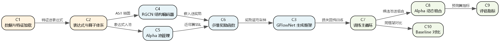

# AlphaSAGE 知识笔记

> 由 RepoGuide 自动生成 · 分析档位：deep

## 项目简介

AlphaSAGE 是基于 **GFlowNet** 与 **RGCN** 的量化 alpha 自动挖掘框架，以结构感知编码器（RGCN 作用于 AST）和稠密多维奖励（**IC+SSL+NOV 时间退火**）替代传统 RL，挖掘多样、新颖且高预测力的 alpha 组合，并提供动态线性组合（**Mega-Alpha**）落地。

| 项 | 值 |
|----|----|
| 主语言 | python |
| 文件总数 | 42 |
| 论文 | 已配套 |
| 核心入口 | train_gfn.py, train_ppo.py, train_qcm.py, run_adaptive_combination.py, combine_AFF.py |

## 概念关系图



> 核心概念间的依赖与数据流向（橙=数据配置，蓝=核心算法，绿=训练评估）。

## 目录

> 按以下顺序阅读，由浅入深建立直觉。

1. [数据与特征加载](01_数据与特征加载.md) — 封装 Qlib 行情数据，按股票×天数×特征组织成张量，提供特征枚举与表达式求值...
2. [表达式与算子体系](02_表达式与算子体系.md) — 定义 alpha 表达式的算子、特征、时间常数词表与 AST 求值规则，配合 Q...
3. [GFlowNet 生成框架](03_GFlowNet 生成框架.md) — 基于 Trajectory Balance 的 GFlowNet，通过前向/后向...
4. [RGCN 结构编码器](04_RGCN 结构编码器.md) — 把 RPN token 序列转成关系图，用 RGCNConv 按六类边关系传递消...
5. [Alpha 池管理](05_Alpha 池管理.md) — 维护候选 alpha 集合，按 IC 与互相关阈值筛选入池，支持基于嵌入的 KN...
6. [多维奖励函数](06_多维奖励函数.md) — 稠密奖励 = IC + λ_ssl·SSL + λ_nov·新颖度，SSL 基于...
7. [训练主循环](07_训练主循环.md) — train_gfn.py 的训练主循环：每轮采样轨迹、计算 TB 损失、按 up...
8. [Alpha 动态组合](08_Alpha 动态组合.md) — run_adaptive_combination.py 逐日只用历史窗口筛选 a...
9. [评估指标](09_评估指标.md) — 在 calculator 与滚动组合脚本中计算 IC、ICIR、RankICIR...
10. [Baseline 对比](10_Baseline 对比.md) — PPO、QCM（分布式 RL）、AFF 三类基线，与 GFlowNet 共享数据...

## 数据流总览

数据流从 Qlib 行情加载开始：StockData 将特征张量化后送入表达式体系，QLibStockDataCalculator 求值得到因子值。因子经 GFlowNet 采样轨迹生成新表达式，RGCN 编码器把表达式 AST 转为关系图并提取结构嵌入。AlphaPool 维护候选池，按 IC 与互相关筛选入池。多维奖励 IC+SSL+NOV 驱动 GFlowNet 更新。训练后候选池送入动态组合脚本，滚动回归得到 Mega-Alpha 日度预测。

## 目录结构

```text
AlphaSAGE/
├── src/                          # 核心源码包
│   ├── alpha_gfn/                # GFlowNet 与生成框架
│   │   ├── gflownet.py           # TB 损失与轨迹采样 # GFlowNet 生成框架
│   │   ├── modules.py            # RGCN 编码器与图构建 # RGCN 结构编码器
│   │   ├── alpha_pool.py         # Alpha 池管理入池淘汰 # Alpha 池管理
│   │   ├── config.py             # 表达式算子与特征词表 # 表达式与算子体系
│   │   └── env/
│   │       └── core.py           # 环境与多维奖励 # 多维奖励函数
│   └── alphagen_qlib/            # Qlib 数据对接
│       ├── stock_data.py         # 行情数据加载 # 数据与特征加载
│       └── calculator.py         # 表达式求值与IC # 表达式与算子体系
├── train_gfn.py                  # GFlowNet 训练入口 # 训练主循环
├── train_ppo.py                  # PPO 基线 # Baseline 对比
├── train_qcm.py                  # QCM 基线 # Baseline 对比
├── run_adaptive_combination.py   # 动态组合 Mega-Alpha # Alpha 动态组合
└── combine_AFF.py                # AFF 融合基线 # Baseline 对比
```

## 论文速览

**标题**：AlphaSAGE: Structure-Aware GFlowNet for Alpha Mining

**核心贡献**：

- 提出基于 GFlowNet 的多样化 alpha 生成框架
- 引入 RGCN 结构编码器作用于表达式 AST
- 设计 IC+SSL+NOV 多维稠密奖励与时间退火
- Mega-Alpha 动态线性组合落地

---

> 想深入代码？从第 1 章开始，逐章阅读。每章含类比、核心思路、明星函数与关联公式。