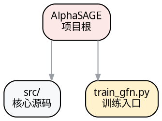

# Phase 2a: 架构与数据流分析

## 执行方式

创建 **architect** agent 执行本 Phase。

```
输入: $WORK_DIR/profile.json
输出: $WORK_DIR/analysis_arch.json
```

## 设计理念（重要）

仓库结构要同时有两种视图：

1. **注释化目录树**：给读者查文件位置，每一行带中文用途注释。
2. **代码树图**：用 graphviz 把目录、核心文件、入口脚本画成紧凑图，帮助读者快速建立空间感。

架构与数据流仍使用单张 graphviz 总览图，强调模块分层和数据流向，不画树状 mermaid 依赖图。

## 任务

1. 读取 `profile.json`（注意 `depth` 字段与 `module_candidates`）。
2. 生成 **`annotated_tree`**：注释化目录树字符串（见下方规范）。
3. 生成 **`code_tree_dot`**：一张 graphviz DOT 源码，展示目录、核心文件、入口脚本和资源的层级关系。
4. 生成 **`architecture_overview_dot`**：一张 graphviz DOT 源码，描述分层架构与数据流转。
5. 撰写 **`data_flow_narrative`**：5-8 句中文叙述，讲清数据从输入到输出的主要流转、训练/评估分界和关键防泄漏点。
6. 生成 **`data_flow_table`**：6-12 行数据流转表，每行 `{step, input, module, output, file}`。
7. 识别 **`key_state_points`**：配置加载、初始化、训练循环、IO 边界、评估切换、缓存/保存等关键状态点。
8. 推断 **`design_decisions`**：3-6 个关键设计决策（含证据与理由）。

## annotated_tree 规范

- 使用 `tree` 命令风格缩进：`├──`、`└──`、`│`、空格。
- 每一行末尾必须带 ` # 中文用途注释`（`#` 前一个空格，注释 ≤ 30 字）。无注释的行不得出现。
- 忽略 `.git/`、`__pycache__/`、`node_modules/`、`.venv/`、`dist/`、`build/` 等。
- 目录与文件都要注释；目录注释说明该目录整体职责。
- 深度建议不超过 5 层；过深的叶子目录可折叠为 `... (N 个文件) # 用途`。

示例：

```text
AlphaSAGE/                      # 项目根：基于 GFlowNet 的 alpha 因子挖掘框架
├── src/                        # 核心源码
│   ├── alpha_gfn/              # GFlowNet 生成器与训练逻辑
│   │   ├── gflownet.py         # GFlowNet 主模型定义
│   │   └── trainer.py          # GFlowNet 训练循环
│   ├── alphagen/               # 通用工具与 RL 基线
│   └── gplearn/                # 遗传规划基线
├── train_gfn.py                # GFlowNet 训练入口脚本
├── run_adaptive_combination.py # 自适应组合评估入口
├── pyproject.toml              # PDM 依赖与项目元信息
└── README.md                   # 项目说明
```

## code_tree_dot 规范

生成 **一张** graphviz DOT 源码字符串，要求：

- `digraph`，`rankdir=TB`，用于表达代码树层级。
- 根节点为仓库名；一级目录、核心包、入口脚本、重要配置作为节点。
- 目录用 folder 风格标签（如 `src/\n核心源码`），文件用 box；入口脚本使用醒目填充色。
- 节点总数 standard ≤ 35，deep ≤ 70；过深目录折叠为 `... N files`。
- 使用 `splines=ortho`、浅色背景、统一中文字体，保证可读。
- 边只表达“包含/归属”，不要混入数据流。

DOT 示例骨架：



## architecture_overview_dot 规范

生成 **一张** graphviz DOT 源码字符串，要求：

- `digraph`，`rankdir=LR`（横向流转，不是树）。
- 用 `subgraph cluster_*` 分层着色：如“数据层”“候选生成”“训练/奖励”“滚动评估”“输出层”。
- 节点为模块/关键文件，边标注数据/调用方向（中文标签）。
- 节点形状用 `box, style="rounded,filled"`，配色协调。
- 字体设 `fontname="Microsoft YaHei"`（Windows）/`PingFang SC`（macOS）/`Noto Sans CJK SC`（Linux）。
- 图尺寸适中，standard 节点 ≤ 25，deep 节点 ≤ 40；细节文件放代码树图，不塞进架构图。

DOT 示例骨架：


## 按 depth 调整范围

### standard

- 注释化目录树保留核心目录层级。
- 代码树图覆盖根目录、核心包、入口脚本、主要配置。
- 架构总览图覆盖主要模块。
- 数据流叙述 5-6 句，流转表 6-8 行。
- 状态点覆盖主要入口与关键切换。

### deep

- 完整注释化目录树，每个主要文件带注释。
- 代码树图覆盖所有主要目录、核心文件、入口脚本、配置和关键资源。
- 架构总览图覆盖所有主要模块与关键文件。
- 数据流叙述 6-8 句，流转表 8-12 行。
- 状态点覆盖配置、初始化、训练循环、IO、错误处理、评估、生命周期。

## 输出 JSON

```json
{
  "annotated_tree": "字符串，每行带 # 中文注释",
  "code_tree_dot": "digraph 字符串，rankdir=TB，展示目录和核心文件层级",
  "architecture_overview_dot": "digraph 字符串，rankdir=LR，分层着色",
  "data_flow_narrative": "5-8 句中文叙述",
  "data_flow_table": [
    {"step": "1", "input": "...", "module": "...", "output": "...", "file": "..."}
  ],
  "key_state_points": [
    {"name": "...", "description": "...", "file": "...", "line": 0}
  ],
  "design_decisions": [
    {"decision": "...", "evidence": "file:line", "reasoning": "..."}
  ],
  "limitation_notes": []
}
```

## 输出校验

使用 `_index.md` 中的 `validate_json` 校验 `$WORK_DIR/analysis_arch.json`：

```python
validate_json(
    "$WORK_DIR/analysis_arch.json",
    required_fields=["annotated_tree", "code_tree_dot", "architecture_overview_dot",
                     "data_flow_narrative", "data_flow_table",
                     "key_state_points", "design_decisions", "limitation_notes"],
)
```

附加检查：`annotated_tree` 中非空行 ≥ 80% 须含 ` # ` 注释；`code_tree_dot` 须含 `rankdir=TB`；`architecture_overview_dot` 须含 `rankdir=LR` 与至少一个 `cluster_`；`data_flow_table` 在 standard 至少 6 行、deep 至少 8 行。

## 下一 Phase

本 Phase 与 [phase-2-code-analyst.md](phase-2-code-analyst.md) 并行执行。